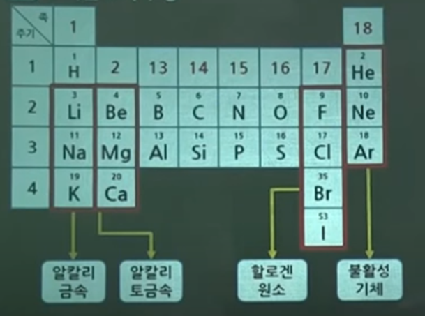

- ### 주기율표
	- 
	- 암기법 
	  헤헤 
	  니베비키니옷벗네 
	  나만알지폭쉬그라 
	  ㅋㅋ
- ### 원소의 반응시 생성물질
	- H + O -> $H_2O$
	- C + O -> $CO_2$
	- C + S -> $CS_2$ (이황화탄소)
	- S + O2 -> $SO_2$ (이산화황=아황산가스) , 연소시 아황산가스를 발생시키는 것은? 유황
	- H + S -> $H_2S$ (황화수소)
	- P + H -> $PH_3$ (인화수소=포스핀)
	- P + O -> $P_2O_5$ (오산화인)
- ### 연소반응식
	- CH3COCH3 +4O2  -> $3CO_2 + 3H_2O$
	- P4 +5O2                  -> $2P_2O_5$
	- CS2 +3O2                -> $CO_2 + 2SO_2$
	- C6H6 +7.5O2           -> $6CO_2 + 3H_2O$
- ### 물질이름
	- |물질이름|화학식|기타|
	  |메탄|CH4||
	  |에탄|C2H6||
	  |프로판|C3H8||
	  |부탄|C4H10||
	  |아세틸렌|C2H2||
	  |벤젠|C6H6||
	  |아세톤|CH3COCH3||
	  |암모니아|NH3||
	  |황린|P4||
-
-