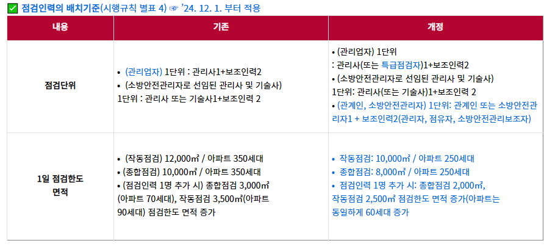

- ### 소방시설의 종류
  collapsed:: true
	- ((63aef3e7-6dc1-47dd-a12c-7ca05e4248e5)) (시설법 별표1)
	- ==방화설비는 포함되지 않는다==
	- 소화설비
	  collapsed:: true
		- 소화기구
		- 옥내,옥외소화전설비
	- ==피난구조설비== (유비피난)
	  collapsed:: true
		- ==유도등==
		- ==비상조명등==
	- 소화용수설비
	  collapsed:: true
		- 소화수조,저수조
	- 소화활동설비
	  collapsed:: true
		- 연결송수관설비
		- 연결살수설
		- 무선통신보조설비
		- ==제연설비==
		- ==비상콘센트설비==
		- 연소방지시설
	- 경보설비
	  collapsed:: true
		- 가스누설경보기
		- 통합감시시설
		- 자동화재속보설비
		- 비상방송설비
		- 단독경보형설비
		- X 비상콘센트설비
- ### 설치대상 #card
  id:: 63f2c93a-b38a-42a3-8c49-2b61cadbaaec
  collapsed:: true
	- ### 소화기 설치대상
		- ==연면적 33 이상==인 것
		- 노유자시설은 투척용 소화용구 등을 산정된 소화기 수량의 ==1/2== 이상
	- ### 스프링클러 설치대상
		- [@시설법 시행령 별표4](((63abe9b8-e7b1-464e-9335-456adab4e1a9)))
		- 암기 : 오륙도 스프링 지하가천
		- ==지하가 (터널제외) : 연면적 1000 이상==
		- ==복합건축물로서 연면적 5000 이상==인 경우에는 모든 층
		- ==6층 이상 : 전층==
		- 숙박이 가능한 수련시설 용도로 사용되는 시설의 바닥면적의 합계가 600이상 모든 층
		- 창고시설(물류터미널제외)로서 바닥면적 5000 이상인 경우의 모든 층
		- ((63f8c073-5d9e-488d-81a2-4404cf9fddeb))
		- ((63f8c24f-c81d-4c5d-ad8f-226ae6970924))
		- ((63f8c2ba-49d9-4b05-95d1-e59d73b195b8))
		- ((63f8c468-89fa-4fed-9932-0ddbee98409c))
		- ((63f8ce63-8ff3-4cf0-a47e-3e8e6fc3a227))
		- ((63f8cff4-d229-4171-a04c-47e408d31e2d))
		- ((63f8d2f1-4975-4950-9381-fbd33f922d94))
	- ### 간이스프링클러 설치대상
		- [@시설법 시행령 별표4](((63b04084-ac50-410c-90d6-7b154a085b74)))
		- 간큰천
		- ==근린생활시설로 사용하는 부분의 바닥면적 합계가 1천㎡ 이상==인 것은 모든 층
		- ((63f8c387-7d0b-43a7-b2f7-23a954d987a2))
	- ### 자동화재탐지설비 설치대상
		- [@시설법 시행령 별표4](((63abe9ce-ad6f-4aed-b617-fd6e9ef23977)))
		- 공동주택 중 아파트등ᆞ기숙사 및 숙박시설의 경우에는 모든 층
		- 의료시설 중 정신의료기관 : 바닥면적 300 이상
		- ==근린생활시설(목욕장 제외),의료시설(정신의료기관 및 요양병원 제외) : 연면적 600 이상==
		- ==근린생활시설 중 목욕장 : 연면적 1000 이상==
		- 노유자 생활시설의 경우에는 모든 층
		- 의료시설 중 요양병원 : 전부
		- ==지하가(터널은 제외한다)로서 연면적 1천㎡ 이상인 경우에 모든 층==
		- ==지하가 중 터널로서 길이가 1천m 이상인 것==
		- ==지하구== [@기출](((63f3896e-3a39-4cc5-ae77-37f1bc74cd1b)))
		- 특수가연물 저장,취급 : 지정수량 500배 이상
		  수련시설(숙박시설이 있는 것 ) : 수용인원 100명 이상
		  층수가 6층 이상인 건축물의 경우에는 모든 층 (참고)
		- ((63f8bb98-1dd9-4ad7-b803-0237969e24c0))
		- ((63f8c0f6-baaf-42c1-89d1-48087b050433))
		- ((63f8cd33-5227-4968-80f1-c9101602546f))
		- ((63f8cdec-fc29-49aa-9b35-2dad6cc0ab2c))
		- ((63f8d09a-3cd0-416d-a7b6-1e8fc65879f9))
	- ### 자동화재속보설비의 설치대상
		- ((63b040b2-ff4c-4fef-9558-c08053f95d76)) (별표4)
		- 수련시설(숙박O),노유자시설,정신병원 및 의료재활시설 : ==바닥면적 500 이상  (세속오계)==
		- 보물 또는 국보로 지정된 목조건축물
		- 전통시장
		- X 지하가 중 터널
		- ((63f8c552-0519-465a-9ade-470eec03564d))
		- ((63f8cb35-b808-4b24-a758-d26961f45f6d))
		- ((63f8cdbd-b45e-4db0-a16a-8a0914bd56a7))
		- ((63f8d1f7-376c-4978-85f2-5d7cb8a4b7c8))
	- ### 비상경보설비 설치대상
	  id:: 63f4053c-bbfb-4423-b2c4-9f267087a578
	  collapsed:: true
		- [@시설법 시행령 별표4](((63abea09-fc3b-489d-8ee9-d2f758d02377)))
		- 암기:경사지무50
		- 건축허가등의 동의대상물의 범위기준과 유사하다 (연면적 조건과 지하층,무창층 조건)
		- ==연면적 400 이상 모든 층==
		- ==지하층,무창층의 바닥면적 150 (공연장 100) 이상==
		- ==지하가 중 터널 길이가  500m 이상인 것==
		- ==50명 이상의 근로자가 작업하는 옥내작업장== (옥내작업장 조건은 비상경보설비에만 있다)
		- ((63f8c14d-6b90-4504-be73-4d3e3b0abc15))
		- ((63f8c346-980b-4e13-aa2f-deff399f63cf))
		- ((63f8c493-41be-4a56-ae46-014a8f165c7a))
		- ((63f8c4cc-7da5-4511-b14c-4e79b2e0d4a6))
		- ((63f8c507-29d3-471a-8248-3d639e705291))
		- ((63f8ca71-cf08-4d39-b8d2-5cd990cbc971))
		- ((63f8cfcc-7a5b-4c31-9f3c-d076f007d508))
	- ### 단독경보형 감지기 설치대상
		- [@소시법 시행령 별표4](((63abec6c-f46d-45d6-b562-0b9584695046)))
		- 연면적 ==400㎡ 미만의 유치원==
		- 교육연구시설 내에 있는 기숙사 또는 합숙소로서 연면적 2천㎡ 미만인 것
		- 수련시설 내에 있는 기숙사 또는 합숙소로서 연면적 2천㎡ 미만인
		- 모두 ~미만으로 되어있다
		- X 아파트
		- ((63f8c1af-8b72-4ae1-960c-8e7700d9d139))
		- ((63f8c3b7-c7c4-4667-8893-6ab011791363))
		- ((63f8c9bf-7ebc-40e5-b708-461f9a0f3b14))
		- ((63f8ca46-eea5-45a5-ae00-92089c5f0f54))
	- ### 비상방송설비 설치대상
	  id:: 63f4053c-6b1b-4d72-96d0-869fce5e5ac4
	  collapsed:: true
		- ((63abe9fa-40ab-4134-a68a-236100d0ac59))
		- 암기 : 3층 11층에서 상호비방
		- ==연면적 3천5백㎡ 이상인 것은 모든 층==  (규모가 크기때문에 직접 음성으로 알리려는 취지)
		- ==층수가 11층 이상인 것은 모든 층==
		- ==지하층의 층수가 3층 이상인 것은 모든 층==
		- ((63f8c00a-5fae-44b8-969c-bc3f1d12afbf))
		- ((63f8cb8d-02b5-487f-a745-5364c48dc20a))
	- ### 비상콘센트 설치대상
		- ((63b06865-e848-4d86-b978-4e691e0511e8)) (별표4)
		- 5년치 기출 X ,실기O
		- 층수가 11층 이상인 특정소방대상물의 경우에는 11층 이상의 층
		- 지하층의 층수가 3층 이상이고 지하층의 바닥면적의 합계가 1천㎡ 이상인 것은 지하층의 모든 층
		- 지하가 중 터널로서 길이가 500m 이상인 것
		- VS 비상방송설비 (11층 이상 것은 모든 층 , 지하 층수가 3층 이상인 것은 모든 층)
		- ((63f8cc8a-5160-4037-8856-5d813a0e6a65))
		- ((63f8d09a-3cd0-416d-a7b6-1e8fc65879f9))
	- ### 무선통신보조설비 설치대상
		- ((63b06919-dbd4-49f3-826f-fa1c83eac2cd)) (별표4)
		- ==층수가 30층 이상인 것으로서 16층 이상 부분의 모든 층==
		- 지하층의 바닥면적의 합계가 3천㎡ 이상인 것 또는 ==지하층의 층수가 3층 이상이고 지하층의 바닥면적의 합계가 1천㎡ 이상인 것은 지하층의 모든 층==
		- 지하가(터널 제외) 연면적 1천㎡ 이상인 것
		- 지하가 중 터널로서 길이가 500m 이상인 것
		- ((63f8cbb3-9da2-423c-abb2-5b64f84bc155))
	- ### 물분무등 소화설비 설치대상
		- ==항공기 격납고==
		- ((63f8d2bb-d346-4830-ad15-5fa5a4a4ae38))
	- ### 연결살수설비 설치대상
		- ((63f2d833-a1b9-4f38-ab84-c461983281f7))
		- 지하층(피난층으로 주된 출입구가 도로와 접한 경우는 제외한다)으로서 바닥면적의 합계가 150㎡ 이상인 경우에는 지하층의 모든 층. 다만, 「주택법 시행령」 제46조제1항에 따른 국민주택규모 이하인 아파트등의 지하층(대피시설로사용하는 것만 해당한다)과 교육연구시설 중 학교의 지하층의 경우에는 ==700㎡이상==인 것으로 한다
		- ((63f8ce2f-900e-4dae-ad95-ec7659221e6d))
	- ### 휴대용비상조명등
		- ((63f8cf5d-e15d-43f8-8c00-cd0e617b93f8))
	- ### 임시소방시설의 종류와 설치기준
		- [@시행령 별표8](((63abf15f-3f99-4bdc-9a43-fe7120604776)))
		- 소화기
		- 간이소화장치설치 기준  (이것만 기출 ==3지무46==)
		        다음의 어느 하나에 해당하는 공사의 화재위험작업현장에 설치한다
			- ==연면적 3000== 이상
			- 지하층,무창층 또는 ==4층 이상==의 층. 이 경우 해당 층의 ==바닥면적이 600== 이상인 경우만 해당
		- 가스누설경보기
		- 간이피난유도선
		- 비상조명등
		- 방화포
	- ### 주택의 소유자가 설치하는 소방시설의 설치대상
		- 단독주택
		- 공동주택 (==아파트 및 기숙사 제외==) : 연립주택,다세대주택,다가구주택
	- ### 주택용 소방시설의 설치대상
		- 설치대상
			- 단독주택
			- 공통주택 (아파트,기숙사 제외)
		- 소방시설
			- 소화기
			- 단독경보형감지
	- ### 인명구조기구의 설치대상
		- 방화열공인
		- 방열복
		- 방화복
		- 공기호흡기
		- 인공소생기
		- X 공기안전매트 (피난구조설비)
	- ### 지하가 중 터널길이
		- ==인명구조기구는 길이와 상관없이 오답이다==
		  1000m는 모두 기재한것이고, 이외는 모두 500으로 외우자
		- 500m 이상
			- 무선통신보조설비
			- 비상경보설비
		- 1000m 이상 (==옥자제천==)
			- 옥내소화전설비
			- 자동화재탐지설비
			- 제연설비
		- ((63f8c282-244f-4872-8c55-1359f625d30d))
- ### 방염
  collapsed:: true
	- 방염성능기준 : 대통령령
	- 방염성능검사 : 소방청장(한국소방산업기술원)
	  collapsed:: true
		- 예외: 합판,목재를 설치현장에서 방염처리하는 경우 : 시도지사
	- ### 방염성능기준 이상 적용 특정소방대상물
	  collapsed:: true
		- ((63ac0243-b8db-4d62-80fa-49739a2531d0)) (소방시설법 시행령)
		- 층수가 11층 이상인 것 (==아파트 제외==)
		- 의료시설(종합병원,정신의료기관)
		- 숙박이 가능한 수련시설
		- 방송국 및 촬영소
		- 아닌 것
		  collapsed:: true
			- 수영장
			- KT
			- 아파트
	- ### 방염대상물
	  collapsed:: true
		- 두께가 2mm 미만인 벽지류 (==종이벽지 제외==)
		- 커튼류
		- 카펫
		- 전시용 합판
	- ### 방염성능기준
	  collapsed:: true
		- 불꽃에 의하여 완전히 녹을 때까지 불꽃의 접촉횟수는 3회 이상
		- 탄화(炭化)한 면적은 50제곱센티미터 이내, 탄화한 길이는 20센티미터 이내일 것
		- 잔진시간 : 30초 (불꽃을 제거한 때부터 불꽃을 올리지 아니하고 연소상태가 그침)
		- 잔염시간 : ==20초== (불꽃을 제거한 때부터 불꽃을 올리며 연소상태가 그침)
- ### 변경강화기준 적용설비
  collapsed:: true
	- 대통령령 또는 화재안전기준이 변경되어 그 기준이 강화되는 경우 기존 특정소방대상물의 소방시설 중 강화된 기준을 적용하여야 하는 소방시설 ((63abdd01-5b15-43de-b9a8-4283fbb4dacf)) (소방시설법)
	- 암기 : ==소비자노피공지 경비==를 낮춰야 한다
	- 소화기구
	- ==비상경보설비==  <- 기출로 이것만 3번 나왔다
	- 자동화재탐지설비
	- 자동화재속보설비
	- 피난구조설비
	- 공동구
	- 노유자시설
	- 전력 또는 통신사업용 지하구
	- X : 비콘,비방,옥내소화전
	- ((63f85d14-9537-44cf-bd86-14eaef1e1f0a))
- ### 건축허가등의 동의대상물의 범위기준 
  collapsed:: true
	- ((63abf246-098f-4361-87dc-62991da00db8)) (소방시설법 시행령)
	- 면적기준
		- 400 :  기본 연면적
		- 300 : 정장 (정신의료기관,장애인 의료재활시설)
		- 200 : 수노 (수련시설,노유자시설)
		- ==100== : 학교시설
	- 차고,주차장
		- 바닥면적 200 이상
		- 20대 이상
	- 지하층,무창층
		- 바닥면적 ==150== 제곱미터(공연장은 100 제곱미터)이상 = 비경설치대상
	- 높은 층고
		- 항공기 격납고,관망탑,항공관제탑,방송용 송수신탑 (X철탑)
	- 면적무관
		- 6층 이상
		- 요양병원
		- 위험물 저장 및 처리 시설
	- ((63f85df5-b5ad-40ec-84b3-c1e56d87a3b5))
	- ((63f85e6a-7fec-4824-92f3-850f584ef046))
	- ((63f85ea7-5fc0-487f-9db5-89afabd30b23))
- ### 성능위주설계 범위 기준
  collapsed:: true
	- [@시설법 8조](((63b3f499-eb07-47ce-9a2b-8603044ca2d3)))
	  [@시설법 시행령 9조](((63b42ffb-d180-4f23-95c7-ec1f701e78a0)))
	- 연면적 ==20만제곱미터 이상==인 특정소방대상물 (아파트 제외)  (이성계)
	- 50층 이상(지하층은 제외한다)이거나 지상으로부터 높이가 ==200미터 이상인 아파트==등
	- 30층 이상(지하층을 포함한다)이거나 지상으로부터 높이가 120미터 이상인 특정소방대상물(아파트등은 제외한다)
	- ==영화상영관이 10개 이상==인 특정소방대상물
	- 연면적 3만제곱미터 이상인 특정소방대상물로서 다음 각 목의 어느 하나에 해당하는 특정소방대상물 (철도,공항시설)
	- 특급소방대상물과 유사하니 비교 검토 필요
	- ((63f85fbd-d375-42ce-b159-0981ace41496))
	- ((63f85ff0-16f5-4a42-b881-c956a0ddc3c2))
	- ((63f86062-6069-4103-907f-74e3f14d9f34))
- ### 종합점검 대상 기준
  collapsed:: true
	- [@시설법 규칙 별표3](((63bbdc38-9b70-41ad-bf05-b9d723dd3592)))
	- 스피링클러설비가 설치된 특정소방대상물
	- 물분무등소화설비(==호스릴방식의 물분무등소화설비만을 설치한 경우는 제외==)가 설치된 연면적 ==5000== 이상인 특정소방대상물 (==위험물제조소 등 제외==)
	- 완공검사 현장확인 대상물과 유사
	- ((63f860cc-052b-4a99-ad36-a647963afad6))
	- ((63f8610e-7c14-46cb-8969-523455ac8d12))
	- ((63f8612e-b278-4bfc-b000-eb9b03a32fc3))
	- ((63f86171-fceb-4da5-835e-648de65e339b))
	- ((63f861b8-6b83-4aaf-8f7b-31e24e2a0543))
	- ((63f861f0-0de2-4161-8c2d-1f888405f7c1))
- ### 소방시설 설치의 면제(대체)기준
  collapsed:: true
	- ((63abfe96-cb14-407b-83c9-6a9a1d61bf1c)) (별표5)
	- 물분무등소화설비 와 스프링클러는 상호 대체 가능
	- 간이스프링클러 대체 설비 : 스프링클러,물분부소화,미분무소화설비
	- ==간이스프링클러를 설치하여 스프링클러를 면제 받을 수 없다==
	- ==연결살수설비 대체 설비== : 스프링클러,==간이스프링클러==,물분무소화설비,미분무소화설비
	- 자탐 대체 : 자탐의 기능과 성능을 가진 화재알림설비, 스프링클러설비 또는 물분무등소화설비
	- 상수도소화용수설비 : 상수도소화용수설비를 설치해야 하는 특정소방대상물의 각 부분으로부터 수평거리 140m 이내에 공공의 소방을 위한 소화전이 화재안전기준에 적합하게 설치되어있는 경우에는 설치가 면제된다(건물의 계량기를 사용하는 경우이고, 75미리 이상의 수도관을 사용해야하는데 공공 소화용수설비가 있으면 면제 받을 수 있다)
	- ((63f8d4aa-d92b-4d1a-a8bc-4fc6b6652d38))
	- ((63f8c0af-9161-47ef-8de3-70e9b1dfec13))
	- ((63f8d51c-adea-4c97-8d9d-b7245a810565))
	- ((63f8d55c-264c-4497-a75d-19cbcc342f11))
	- ((63f8d648-3de4-4f5f-b4bc-924d930c8e6b))
	- ((63f8d681-0724-42f2-bb5c-11730092387b))
	- ((63f8d6c1-6f71-4580-8724-5ae1f29f52f9))
- ### 소방시설을 설치하지 아니할 수 있는 특정소방대상물 범위
	- [@시설법 시행령 별표6](((63abfff3-c1a3-4fcd-8e46-d04af43e81f8)))
	- ==연결살수설비가 공통==으로 들어가는 듯 하다
	- 화재안전기준을 **적용하기 어려운** 특정소방대상물
		- 음료수공장
			- 스프링클러설비
			- 상수도소화용수설비
			- 연결살수설비
			- X : 연결송수관설비
	- 화재위험도가 낮은 특정소방대상물
		- ==옥외소화전설비==
		- 연결살수설비
	- 화재안전기준을 **달리 적용**하여야 하는 특수한 용도 또는 구조 (원자력발전소,핵폐기물처리)
		- ==연결송수관설비==
		- 연결살수설비
	- 자체소방대가 설치된 특정소방대상물
	- ((63f8636d-1956-4631-891a-6fdae08131e5))
	- ((63f863be-03bc-4228-91e2-d64cd2303683))
	- ((63fc3953-16cd-472d-9970-bf7d1e4c65b9))
### 소화기의 내용연수
collapsed:: true
	- ==10년==
- ### 점검한도면적
  collapsed:: true
	- 점검인력 1단위가 하루 동안 점검할 수 있는 연면적
	- 종합점검 : 1만 제곱미터 => 8000 (법 개정)
	- 작동점검 : 1만2천 제곱미터 => 10000 (법 개정)
	- [@소방시설법 시행규칙 별표4](((63dc621c-21f0-4007-93cf-d4ea01fcbc33)))
	- 
- ### 수용인원 산정방법 
  collapsed:: true
	- ((63ac0071-6808-489b-b63c-f80c3c92fece)) (별표7)
	- 숙박시설
		- 침대가 있는 경우 : 종사자수 + 침대수
		- 침대가 없는 겨우 : 종사자수 + 바닥면적 / ==3== (없삼)
	- 강의실,상담실,휴게실 : 바닥면적 / 1.9 (강일구)
	- 기타(백화점 등) : 바닥면적 / 3
	- ==강당==, 문화 및 집회시설,운동시설, 종교시설 (공통으로 ==관람석X==) : 바닥면적 / ==4.6== (문사륙)
	- ((63f85bfd-df77-42c6-a1ea-c061242889f3))
	- ((63f85c59-3e0f-47b9-ab18-069561a1b681))
	- ((63f85ca0-b68a-4259-87d9-04e462e21426))
- ### 소방용품
  collapsed:: true
	- ((63ac0153-996b-40a0-adc3-78f5ba9ec31f)) (별표3)
	- 소화설비
	  collapsed:: true
		- 소방호스
		- 분말소화장치
		- X : 가스누설경보기
	- 경보설비
	  collapsed:: true
		- 누전경보기
		- 가스누설경보기
	- 피난구조설비
	- 소방용품이 아닌것
	  collapsed:: true
		- ==소화약제 외의 것을 이용한 간이소화용구== (마른모래,..)
		- 시각경보기
		- 사이렌
		- ==휴대용비상조명등==
		- 공기안전매트
		- 소화할동설비용품(비상콘센트 등)
		- ((63f858d6-b4f7-4e07-a021-5172c43bd261))
### 소방기관의 설치
collapsed:: true
	- 시도에서 소방업무를 수해하기 위하여 ==시도지사== 직속으로 소방본부를 둔다
	- ((63f8585d-2de6-4a8e-87b8-3791c0c78db2))
### 청문실시 대상
collapsed:: true
	- 소방시설관리사 자격의 취소 및 정지
	- 소방시설관리업의 등록취소
	- 소방용품의 형식승인취소
	- X 소방안전관리자의 자격의 취소
### 소방시설업의 기술인력을 변경하는 경우의 서류
collapsed:: true
	- 소방시설업 등록수첩
	- 변경된 기술인력의기술자격증
	- 기술인력연명부
	- X 사업자등록증 사본
	- ((63f85809-29f4-49da-9b2d-eec6cba34745))
- ### 하나의 소방대상물로 보는 경우 
  collapsed:: true
	- 둘이상의 소방대상물이 내화구조 복도 또는 통로로 연결되는 경우로 하나의 소방대상물로 보는 경우
	- 벽이 없는 경우 : ==6m 이하==
	- 벽이 있는 경우 : 10m 이하
	- [@소방시설법 시행령 별표2](((63dc6010-0ef4-471d-b4ea-acff707cd5fa)))
	- ((63f8574f-27d5-4992-9bdd-ea58bb5a5a96))
- ### 특정소방대상물 
  collapsed:: true
	- 건축물 등의 규모,용도 및 수용인원 등을 고려하여 소방시설을 설치하여야 하는 소방대상물로서 ==대통령령==으로 정하는 것을 말한다
	- 의료시설
		- ((63b4512a-e268-4d1c-9064-076b2e088a5d))
		- 요양병원
		- 한방병원
		- 마약진료소
		- X ==노인의료복지시설 -> 노유자시설==
		- 의료 시설 중 병원에 해당되지 않는 것?
		  collapsed:: true
			- 전마정장
			- 전염병원
			- 마약진료소
			- 정신의료기관
			- 장애인재활의료시설
	- 업무시설
		- 보건소
		- ==오피스텔== : X숙박업
	- 운수시설
		- 터미널
	- 항공기 및 자동차관련시설
		- 주차장
		- 세차장
		- 운전학원
		- 항공기격납고
	- 숙박시설
		- 고시원
	- 공통주택
		- 기숙사
- ### 위원회
  collapsed:: true
	- #### 소방기술심의의원회
		- 중앙
			- 소방청장
			- ==소방시설공사의 하자==를 판단하는 기준에 관한 사항
			- ((63fc388d-fe2f-4b19-9e69-2c778fae612c))
		- 지방
			- 시도지사
			- 소방시설에 하자가 있는지의 판단에 관한 사항
	- #### 화재안전조사위원회
	  collapsed:: true
		- ((63f2bff5-4fea-4ab8-b569-8e337b7d0ccf))
- ### 소방시설의 내진설계
  collapsed:: true
	- 옥내소화전
	- 스프링클러
	- 물분무등 소화설비
	  collapsed:: true
		- 물분무
		- 미분무
		- 포
		- 이산화탄소
		- 할론
		- 할로겐화합물 및 불활성기체
		- 분말
		- 강화액
		- 고체에어로졸
### 용어
collapsed:: true
	- 소방시설/소방시설 등/특정소방대상물/소방용품 : 대통령령
	- 소방대장 : 소방본부장 또는 소방서장 등 현장에서 소방대를 지휘하는 사람