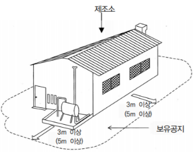

- ### 위험물 정의
  collapsed:: true
	- 가연성고체
	- 산화성고체
	- ==인화성고체== : 1기압 상태에서 인화점이 40도 미만인 고체 [@위험물별표4](((63eeff82-21a0-4a87-8199-243ef8aa297b)))
	- 자연발화성 및 금수성물질
	- ((63f766f9-3e38-449e-b37d-fab81da8a5b7))
- ### 방유제의 기준 #card
  id:: 63f3598c-2480-4eb4-b226-d9363169b0c4
  collapsed:: true
	- 인화성 액체 위험물(이황화탄소제외)의 옥외탱크저장소의 탱크 주위에 설치
	- 방유제 높이는 ==0.5~3m== 이하로 할 것
	- 두께 : 0.2m 이상
	- 지하매설깊이 : 1m 이상
	- 방유제 내의 면적은 ==8만 이하==로 할 것
	- 높이가 1m를 넘는 방유제 및 간막이 둑의 안팎에는 방유제 내에 출입하기 위한 계단 또는 경사로를 약 ==50m==마다 설치할 것
	- 방유제 용량
		- 위험물 옥외저장탱크
			- 1기 이상 : 탱크용량 x 110% 이상
			- 2기 이상 : 최대탱크용량 x 110% 이상
		- 위험물제조소의 옥외에 있는 위험물 취급탱크 [cbt](https://hellocbt.com/index.php?mid=exam&exam_srl=9678)
			- 1기 : 탱크용량 x 0.5
			- 2기 이상 : 최대 탱크용량 x 0.5 + 기타 탱크용량의 합 x 0.1
- ### 제조소 등의 설치허가 
  collapsed:: true
	- 설치허가자 : ==시.도지사==
	- 제조소 등의 변경신고 : 변경하고자 하는 날의 ==1일== 전까지 ==시도지사==에게 신고 (==행정안전부령==)
	- 설치허가를 받지 않아도 되는 기준 [cbt](https://hellocbt.com/index.php?mid=exam&exam_srl=11602)
		- ==주택의 난방시설(공동주택의 중앙난방시설은 제외)을 위한 저장소 및 취급소==
		- 지정수량 ==20배 이하==의 농예용,축산용,수산용 난방시설 또는 건조시설의 저장소
- ###  제조소 등의 기준
  collapsed:: true
	- [cbt](https://hellocbt.com/index.php?mid=exam&exam_srl=80823)
	- #### 정기정검의 대상인 제조소등
		- 지하 탱크저장소
		- 이동 탱크저장소
		- 예방규정을 정하여 할 제조소등
	- #### 예방규정을 정하여 할 제조소등
	  ((63ae42e7-a1cd-4e20-b6f3-3ae59a5a79a4))
		- 십제 , 백외 , 십오내, 이십탱
		- ==10배== 이상 : ==제조소== , 일반취급소
		- 100배 이상 : ==옥외==저장소
		- 150배 이상 : 옥내저장소
		- ==200배 이상 : 옥외탱크저장소==
		- 암반탱크저장소
		- 이송취급소
		- ==X 제3석유류는 해당되지 않는다==
	-
- ### 위험물제조소의 보유하여할 공지의 너비 
  collapsed:: true
	- 지정수량의 10배 이하 : ==3m 이상==
	- 지정수량의 10배 초과 : 5m 이상
	- 
	- 주유소 보유공지
		- 주유를 받으려는 자동차 등이 출입할 수 있도록 너비 15m 이상, 길이 6m 이상의 콘크리트 등으로 포장한 공지
- ### 자체소방대를 설치하여야 하는 사업소 
  collapsed:: true
  id:: 63f8002a-5f5f-4613-b2ef-a3d4aa48e9a7
	- [@위험물 관리령](((63f332bb-ba4c-4d85-bffd-7faca6ab4139)))
	- 대통령령
	- 제4류 위험물을 취급하는 제조소 또는 일반취급소
		- 다만, ==보일러로 위험물을 소비하는 일반취급소 등 행정안전부령으로 정하는 일반취급소는 제외한다==.
		- 제조소 또는 일반취급소에서 취급하는 ==제4류 위험물의 최대수량의 합이 3천배 이상==
	- 제4류 위험물을 저장하는 옥외탱크저장소
		- 옥외탱크저장소에 저장하는 제4류 위험물의 최대수량이 지정수량의 50만배 이상
	- 지정수량에 따른 자체소방대를 두는 화학소방자동차 및 인원
		- ~ 12만배 : 1/5
		  ~ 24만배 : 2/10
		  ~ 48만배 : 3/15
		  ==48만배 이상 : 4대 20인==
		- 화학소방자동차 제독차 방사능력 : 가성소다 및 규조토를 각각 50kg 이상 비치
		- 분말 방사차 방사능력 : 35 kg/s 이상
	- ((63f814b1-b8ee-4b0c-ad71-13161ec36af9))
	- ((63f814db-fbf3-4c47-a375-6a6d7c5b1fe1))
	- ((63f81571-af09-49cf-bbd2-538046a77816))
	- ((63f7604c-ee16-4259-a84e-3fd50ad25565))
	- ((63f80f2c-0896-4320-916d-6550acae42bc))
	- ((63f80f94-62f2-44ea-9fa8-f3988aee27eb))
- ### 위험물 관련 소방관련 설비
  collapsed:: true
	- ### 옥내탱크저장소에 유황만을 저장,취급하는 경우 소화설비
	  collapsed:: true
		- ==물분무소화설비== (암기:==유물==)
	- ### 피난구조설비
		- ((63aeaddf-c2d5-43ed-9614-2237d7aeed91)) (위험물 별표 17)
		- 옥내주유취급소에 있어서는 ==유도등== 설치
		- 유도등에는 비상전원 설치
	- ### 제조소 등의 자동화재탐지설비 설치기준
		- 일반 자탐설치기준과 동일한 것으로 보임
		- 하나의 경계구역의 면적은 ==600== 이하로 하고 그 한변의 길이는 ==50==m 이하
	- ### 제조소 경보설비 설치기준
		- [@위험물 규칙](((63f33701-8074-4dbe-87af-76689ba6a41f)))
		- 지정수량의 10배 이상의 위험물을 저장 또는 취급하는 제조소 등(==이동탱크저장소 제외==)에는 화재발생시 이를 알릴 수 있는 경보장치를 설치하여야 한다
		- 제조소 및 일반취급소의 연면적이 500 이상인 것에는 자탐을 설치한다
		- 자동신호장치를 갖춘 스프링클러설비 또는 물분무등소화설비를 설치한 제조소 등에 있어서는 자탐을 설치한 것으로 본다
	- ### 피뢰침 
	  collapsed:: true
		- 지정수량의 ==10배== 이상의 위험물을 취급하는 제조소(제6류 위험물을 취급하는 제조소는 제외)에는 피뢰침을 설치하여야 한다 [@위험물 규칙 별표4](((63dc5f30-a4ee-4411-9a14-9ffa50b4df91)))
- ### 제조소 등의 관계인이 지켜야 하는 사항 (위험물안전관리자) 
  collapsed:: true
	- ==위험물안전관리자 재선임 : 30일 이내==
	- 안전관리자를 선임한 경우에는 14일 이내에 소방본부장 또는 소방서장에게 신고
	- 안전관리자가 일시적으로 임무 수행이 안될때는 대리자를 지정해야하고 이 경우 대행하는 기간은 30일을 초과할 수 없다
- ### 제조소 등이 아닌 장소에서 지정수량 이상의 위험물 취급 
  collapsed:: true
	- ((63ae8eb6-d1e9-414f-a23e-04b94eabafab))
	- 임시로 저장 또는 취급하는 장소에서의 저장 또는 취급의 기준은 ==시도의 조례==로 정한다
	- 필요한 승인(==관할소방서장==)을 받아 지정수량 이상의 위험물을 ==90일== 이내의 기간 동안 임시로 저장 또는 취급하는 경우 제조소 등이 아닌 장소에서 지정수량 이상의 위험물을 취급할 수 있다
### 지정수량 미만인 위험물의 저장 또는 취급에 관한 사항
collapsed:: true
	- ((63aea55a-039c-4708-94b7-a2ced64c5bdd))
	- ==시도의 조례==
- ### 특정 옥외탱크저장소의 구조안전점검기간 
  collapsed:: true
	- ==12년== 이내 : ==완공검사 합격확인증==을 받은 날부터
- ### 위험물취급소의 구분 
  collapsed:: true
	- 주유취급소
	- 판매취급소 : 판매하기 위하여 지정수량의 ==40배 이하==의 위험물을 취급하는 장소
	- 일반취급소
	- 이송취급소
	- X 관리취급소
- ### 위험물제조소의 안전거리 
  collapsed:: true
	- 3m 이상  : 35kV 이하의 특고압가공전선
	- 5m 이상  : 35kV 초과하는 특고압가공전선
	- 10m 이상 : 주거용
	- 20m 이상 : 가스 혹은 핵화가스 관련시설
	- 30m 이상 : 기타
	- ==50m 이상 : 유형,지정 문화재==
	- [@위험물 규칙 별표4](((63dc6a84-e04a-46a9-96e9-40505dd075cc)))
### 위험물안전관리법상 청문 실시
collapsed:: true
	- ==제조소 등 설치허가의 취소==
	- 탱크시험자의 등록 취소
- ### 정의
  collapsed:: true
	- ((63aeaf59-c6fc-4d7b-a007-5cd2dded4854)) (위험물령 별표1)
	- "금속분"이라 함은 알칼리금속·알칼리토류금속·철 및 마그네슘외의 금속의분말을 말하고, 구리분·니켈분 및 ==150==마이크로미터의 체를 통과하는 것이 ==50중량퍼센트== 미만인 것은 제외한다