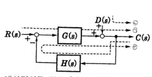
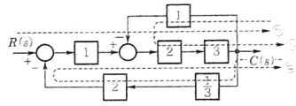

- ### 줄의 법칙 
  collapsed:: true
	- $H=0.24Pt=I^2Rt$  H : 발열량(cal) , t : 시간(s),	==1J = 0.24cal==
- ### 분류기 , 배율기
  collapsed:: true
	- | 배율기                 | 분류기                 |
	  | ---------------------- | ---------------------- |
	  | $m=1+\dfrac{R_s}{R_a}$ | $m=1+\dfrac{R_a}{R_s}$ |
	  | 전압계                 | 전류계                 |
	  | 직렬연결               | 병렬연결               |
	  | 외부저항을 크게        | 외부저항을 작게                       |
	  Ra : 내부저항
	  Rs : 외부저항
	  m :  배율 (원래 측정범위 보다 m배 더 측정할 수 있게한다)
- ### 반도체소자
  collapsed:: true
	- #### SCR
		- ==위상제어==용으로 사용되는 정류소자
		- ==단방향== 대전류 스위칭소자로서 제어할 수 있는 정류소자이다
		- ==양극의 전류의 크기는 게이트전류의 크기에 관계없다.==
		- 래칭전류 : 턴온시킨 후 게이트전류를 0으로 하여도 ON상태를 유지하기 위한 최소의 애노드전류
		- PNPN소자
		- ((63fc2a1e-c4f4-4d65-ba4f-7966a49e774a))
	- #### 바리스터 
	  collapsed:: true
		- 서지전압에 대한 회로보호
		- 다이오드2개를 붙인 모양
		- Variable과 Resistor의 약자로 높은 전압이 걸리면 저항이 현저히 낮아지는 소자를 말합니다.
	- #### 다이오드 
	  collapsed:: true
		- 터널다이오드
		  collapsed:: true
			- 스위칭작용
			- 증폭작용
			- 발진작용
		- 제너다이오드 : 정전압 정류작용
		- 발광다이오드 : 전류가 통과하면 빛을 발산
		- 포토다이오드 : 빛에 닿으면 전류가 직선적으로 증가
	- #### TRIAC
	  collapsed:: true
		- 양방향성 스위칭소자 (AC 전력의 제어용)
	- #### P형 반도체 
	  collapsed:: true
		- (==3억플러스== - 3개 전자 , 억셉터 , 피형 , 플러스가 많다)
		- 불순물 : 억셉터
		- 3가원소
		- + (부족전자)
- ### 전기식 증폭기
  collapsed:: true
	- 앰플리다인 : 입출력이 DC
- ### 변환요소 
  collapsed:: true
	- 변위 -> 압력
	  collapsed:: true
		- 노즐 플래퍼 (변압노~~)
		  공기식 자동제어에 사용하는 기구로서 제어량을 벨로즈 또는 다이어프램을 걸쳐 플래퍼에 전하고, 그 변위에 따라 노즐에서 분출하는 공기량을 조절하여 공기출구의 압력변화를 신호로 조작부의 공기모터에 보낸다
	- 변위 -> 전압
	  collapsed:: true
		- 포텐셜미터
		- 차동변압기
		- 전위차계
		- X 측온저항체 (온도 -> 전압)
- ### 논리식
  collapsed:: true
	- #### 흡수법칙
	  collapsed:: true
		- $X + \overline {X}Y =  X + Y$
		- $\overline {X} + XY =  \overline {X} + Y$
	- #### 드모르간의 정리
	  collapsed:: true
		- $\overline{X+Y}=\overline X \cdot \overline Y$
		- $\overline{X\cdot Y}=\overline X + \overline Y$
- ### 계수
  collapsed:: true
	- 유전율 :  $\epsilon _0 = 8.855 \times 10^{-12}$ [F/m]
	- 투자율 :  $\mu _0 = 4\pi \times 10^{-7}$ [H/m]
- ### RLC 회로
  collapsed:: true
	- 병렬회로 공진주파수 = $f_0 = \dfrac{1}{2\pi \sqrt{LC}}$
	  collapsed:: true
		- RLC 가 병렬이고 전체전류와 저항의 전류가 같으면 공진이다
	- 병렬회로 n고조파 공진주파수 = $f_n = \dfrac{1}{2\pi n \sqrt{LC}}$
	- $Z = \sqrt{R^2 +(X_L-X_C)^2} = R +jX_L - jX_C$
	      복소수이면 L:+j , C:-j 가 되어 합성은 더해주면 된다
	      옴으로 주어지면 XL - XC가 된다
	- 유도성리액턴스 $X_L = 2\pi fL$
	- 용량성리액턴스 $Xc = \dfrac {1}{2\pi fC}=\dfrac{1}{\omega C}$
		- 3고조파 리액턴스 = $\dfrac{1}{3 \omega C}$
	- 유효전력 $P=I^2R$ [w]
	- 무효전력 $P_r = I^2X$ [Var]
	- 교류회로 $I = \dfrac{V}{Z}$
	- LC 직렬회로에서 직류전압 E를 인가하고 t=0 에서 인가 $i(t) = \dfrac{E}{\sqrt{\dfrac{L}{C}}} sin\dfrac{1}{\sqrt{LC}}t$ 
	  (특성임피던스 = 루트(L/C) 라는 공식 => C가 분모로)
	- RL 직렬회로 시정수  $\tau = \dfrac{L}{R}$
	- RC 직렬회로 시정수 $\tau = RC$
	- ((63f9f817-856f-4230-ba4a-19f4c4393633))
	- ((63f9f84d-aeb4-4199-8256-5dae89f7b464))
	- ((63faace0-251f-497a-9be1-8585dfa5d362))
	- ((63fb76d7-ce71-4a02-a575-48a722346591))
- ### 라플라스변환
  collapsed:: true
	- | 원래식        | 변환식             |
	  | ------------- | ------------------ |
	  | $sin\omega t$ | $\dfrac{\omega}{s^2+\omega ^2}$ |
	  | $cos\omega t$ | $\dfrac{s}{s^2+\omega ^2}$                   |
	- 암기 :  south corea
	- ((63fc216d-20c4-44cc-a996-0e3144b3d2fc))
- ### 제어
	- #### 제어량에 의한 분류
		- ==프로세스제어(공정제어)==
			- ==온도,압력,유량,액면(액위)== (암기 : 온오프)
		- 서보기구
			- 위치,방위,==자세==
		- 자동조정
			- 전압,전류류,주파수,회전속도
		- ((63fae394-620e-408b-a9e7-ee63fbb746f7))
	- #### 제어의 종류
		- 정치제어
		- 추종제어
		- 비율제어
			- 목표값이 다른 양과 일정한 비율관계를 가지고 변화하는 제어방식
			- 연료의 유량과 공기의 유량과의 사이의 비율을 연소에 적합한 것으로 유지
		- 프로그램제어
		- ((63fbf95a-e6c6-47db-ae1c-5ea32136e4c3))
	- #### 구성요소
		- 제어요소
			- 동작신호를 조작량으로 변환한다 (X제어량)
			- 조작량 = 제어장치의 출력인 동시에 제어대상의 입력 (==제조,조동아리==)
			- 구성 = 조절부 + 조작부  (==제조==)
		- 서보제어 : 추종제어, X정치제어
		- ==검출부== : 제어대상에서 제어량을 **측정하고 검출하여 주궤한신호를 만드는 것** (검궤)
		- 서보전동기는 제어기기의 어디에 속하는가? : 조작부 (==서보->노예->조작==)
		- ((63faad3a-024e-45c0-b041-b06c2029da1f))
		- ((63fc2ac2-ce3c-4f94-9a19-d577babdb042))
- ### 정류회로 전압 
  collapsed:: true
	- 단상반파 직류 평균전압 = 0.45 x 교류 실효값
	- 단상전파 직류 평균전압 = 0.9 x 교류 실효값
	- 반파 평균값 = 전파 평균값 / 2
	- 반파 실효값 = 전피 실효값 / 루트2
	- 첨두역전압(PIV) = $\sqrt{2}\times 실효전압$ = 피크전압
	- 파형율 vs 왜형률 
	  collapsed:: true
		- 파형율 : $\dfrac{실효값}{평균값}$  (==실평형==)
		- 파고율 :$\dfrac{최대값}{실효값}$   (==최고실==)  , 얼마나 뾰족한지
	- | 파형                  | 최대값 | 실효값                | 평균값           |
	  | --------------------- | ------ | --------------------- | ---------------- |
	  | 정현파,전파정류파 | 1      | $\dfrac{1}{\sqrt{2}}$ | $\dfrac{2}{\pi}$ |
	  | 반파정류파            | 1      | $\dfrac{1}{2}$        | $\dfrac{1}{\pi}$ |
	  | 삼각파                | 1      | $\dfrac{1}{\sqrt 3}$  | $\dfrac{1}{2}$   |
	  | 반구형파              | 1      | $\dfrac{1}{\sqrt{2}}$ | $\dfrac{1}{2}$   |
	  | 구형파                | 1      | 1                     | 1                |
- ### 정류회로와 다이오드 
  collapsed:: true
	- ==직렬연결 : 과전압 방지==(직압,지갑)
	- 병렬연렬 : 과전류 방지
- ### 트랜지스터 증폭률 
  collapsed:: true
	- 이미터접지 증폭률 $\beta = \dfrac{I_C}{I_E - I_C}$
	- ((63fc2262-c833-4dd0-823d-a5ab7c933ff9))
- ### 고유저항 
  collapsed:: true
	- $R = \rho \dfrac{l}{s}$
	- $R_m = \dfrac{l}{\mu S}$
- ### 단위
  collapsed:: true
	- $1W = 1J/s$
	- $1J = 1N\cdot m$
	- $1Wh = 860cal$
- ### 지시계기 
  collapsed:: true
	- 가동철판형 (자기적으로 유사한 재료에 작용하여 생기는 반작용에 의해서 동작하는 계기)
	  collapsed:: true
		- 계기의 구조형태
		  collapsed:: true
			- ==흡인형==
			- ==반발형==
			- ==반발흡인형==
	- 열전형
	  collapsed:: true
		- = 열전대형
		- 금속선의 팽창을 이용
	- 전류력계형
	- 유도형
	- 정전형
- ### 영상분,정상분,역상분
  collapsed:: true
	- 영상분 전압 $V_0 = \dfrac{1}{3} (V_a+V_b+V_c)$
	- 정상분 전압 $V_1 = \dfrac{1}{3} (V_a+aV_b+a^2V_c)$
	- 역상분 전압 $V_2 = \dfrac{1}{3} (V_a+a^2V_b+aV_c)$
	- $a = 1\angle 120\degree$
- ### 변압기시험
  collapsed:: true
	- 단락시험 :임피던스전압 측정 (임단협)
	- 개방시험
### 저항측정
collapsed:: true
	- 절연저항 : 메거 (절묘한 매주)
	- 접지저항 : 어스테스터
	- 전지의 내부저항이나 전해액의 도전률 측정 : 콜라우시브리지
### 컨덴서
collapsed:: true
	- 축척되는 전하량(Q) = $CV$
	- 연결 방식에 따른 차이
		- 병렬 : $Q_1 = \dfrac{C1}{C1+C2}Q$
		- 직렬 :$V1 = \dfrac{C2}{C1+C2}V$
- ### 합성인덕턴스 
  collapsed:: true
	- 자속이 같은 방향 $L = L_1+L_2+2M$
	- 자속이 다른 방향 $L = L_1+L_2 - 2M$
	- $M = K\sqrt{L_1L_2}$  (M:상호인덕턴스 , K:결합계수)
### 어드미턴스(Y)
collapsed:: true
	- 임피던스의 역수
	- RC 직렬회로 어드미턴스궤적 : 1사분면내의 반원 (지름 = 1/R)
- ### 자기저항 
  collapsed:: true
	- 자기저항배수 $m=1 +\dfrac{l_0}{l}\times \mu _s$  
	  $l$ : 길이 , $l_0 : 공극$
	- $R_m = \dfrac{l}{\mu S}$
- ### 피드백제어 
  collapsed:: true
	- 비선형과 왜형은 감소한다 (??이해는 안가네)
	- 발진하는 경향
- ### 자계의 세기 (H) 
  collapsed:: true
	- #### 직선도체
	  거리 r 떨어진 곳의 자계
		- $H = \dfrac{I}{l}=\dfrac{I}{2\pi r}$ [A/m]
	- #### 솔레노이드 (내부)
		- $H = \dfrac{NI}{l}=\dfrac{NI}{2\pi r}$ [A/m]
	- #### 무한장 솔레노이드  (내부)
		- $H = nI$ [AT/m]  (n : 1m당 권수이다 )
		- 내부 자계의 세기는 전류의 세기에 비례
		- 내부 자계의 세기는 권수에 비례
		- 내부 자계의 세기는 위치에 관계없는 ==평등자계==이다
		- 외부자계 H = 0
		- 무한장 원주형 도체에 전류 I가 **표면에만** 흐른다면 원주 내부의 자계의 세기는 몇 AT/m 인가?
		  내부자계는 0이다 (표면에만 흐른다는 조건때문이다)
	- #### 원형코일 중심에서 자계
		- H = $\dfrac{NI}{2a}$ [AT/m] (N=권수 , a=반지름)
		- ((63faaeec-c2f3-4061-90ef-6ba2de14ef52))
	- #### 반지름 r인 원주상 임의의 2점 사이의 전류가 I 일때 중심세 자계의 세기 ??
		- H = $\dfrac{I\theta}{4\pi r}$
	- ((63f9f867-5a42-43d8-8977-669bdb29f066))
- ### 인덕턴스 (L) 
  collapsed:: true
	- 자속 $\phi = BS = \mu HS = \dfrac{\mu SNI}{l}$ [wb]
	  N이 1m당 권선수로 주어지면 길이는 = 1 , B=자속밀도 , H = 자계
	- L = $\dfrac{\mu SN^2}{l}$[H]
	  유도 : $N\phi = LI$
	- 권수가 2배로 늘어나면 자기인덕턴스 4배 , ==유도기전력 4배==
- ### 평행도체 사이에 작용하는 힘 
  collapsed:: true
	- $F = \dfrac{\mu _0I_1I_2}{2\pi r}$ [N/m]
	- ==같은방향이면 흡인력==,다른방향이면 반발력
	- 평행왕복전선은 다른방향이므로 반발력
	- r 은 두평행선사이에 거리이다 -> 힘은 거리에 반비례
- ### 쿨롱의 법칙 
  collapsed:: true
	- #### 점전하에 의한 전계의 세기
	  collapsed:: true
		- E = $\dfrac{Q}{4\pi \epsilon r^2}$
	- #### 두 전하 사이에 작용하는 힘 (정전력 )
	  collapsed:: true
		- F = $\dfrac{Q_1Q_2}{4\pi \epsilon r^2} = QE$ [N]
		- 두 점전하 사이에 작용하는 정전기적 인력은 전하의 곱에 비례하고 , ==거리의 제곱에 반비례==
	- ####  ==면전하의 밀도에 의한 전계의 세기==
	  collapsed:: true
		- 무한 평면 E = $\dfrac{\rho}{2\epsilon}$  무한 평면이므로 대칭의 자기장이 존재하여 2가 나누어 진다
		- 평면 E = $\dfrac{\rho}{\epsilon}$
### 효과
collapsed:: true
	- 광전효과 : 반도체 빛을 쬐이면 전자 방출
	- 핀치효과
	- 톰슨효과
	- 홀효과
	- 제백효과
	- 펠티어효과
	- 압전기효과
	- 압전현상 : 압력,진동을 가하면 소자로부터 전기 발생
### 법칙
collapsed:: true
	- 렌츠의 법칙 : ==자속의 변화==에 의한 ==유도기전력의 방향== 결정
	- 페러데이 법칙 :==자속의 변화==에 의한 ==유기기전력의 크기== 결정
	- 플레밍의 오른속 법칙 : 도체의 운동에 의한 유도기전력의 방향 (발전기)
	- 플레밍의 왼손 법칙 : 자속과 전류에 의한 전자력의 방향 (모터)
	- 비오사바르의 법칙 : ==전류에 의한 자계의 세기==를 구하는 법칙이다
	- KVL : 폐회로에서 전압강하의 합은 그 폐회로 내에 포함된 기전력의 합과 같다
	- 중첩의 원리
	  collapsed:: true
		- 여러 개의 기전력을 포함하는 선형회로망 내의 전류 분포는 각 기전력이 단독으로 그 위치에 있을 때 흐르는 전류분포의 합과 같다
- ### 전동기 
  collapsed:: true
	- #### 단상유도전동기 기동토크
	  collapsed:: true
		- 단상유도전동기 기동토크 : 반발 기동형 > 반발 유도형 > 콘덴서 기동형 > 분상 기동형 >셰이딩 코일형
		- ==반콘분셰==
	- #### 3상유전동기 토크,속도 관계
	  collapsed:: true
		- 토크는  2차 입력에 비례하고 , ==동기속도에 반비례==
		- 토크는 출력에 비례 $P=9.8\omega \tau = 9.8\times 2\pi \dfrac{N}{60} \times \tau$
	- #### 전동기 공식
	  collapsed:: true
		- $N_s = \dfrac{120f}{P}$
		- $N = N_s(1-s)$
	- #### 전기자 제어 직류 서보전동기
		- 계자권선의 전류가 ==일정==하다
		- 교류 서보전동기에 비하여 구조가 간단하여 소형이고 출력이 비교적 ==높다==
		- ((63fb71d0-1bbf-4f47-85a5-1dc8bd13b5ad))
	- #### 3상 직권 정류자전동기에서 고정자권선과 회전자자권선 사이에 중간변압기를 사용하는 이유는?
		- 경부하시 속도의 이상상승 방지
		- 철심을 포화시켜 회전자상수 ==증가==
		- 전원전압의 크기에 관계없이 정류에 알맞은 회전자전압 선택
	- #### 1선 절단
	  collapsed:: true
		- 경부하 : 전류가 증가한 상태에서 회전이 계속된다
		- 중부하 : 속도가 감소하고 부하전류가 급상승한다
### 지락
collapsed:: true
	- 1선지락 : $I_0=I_1=I2$
	- 2선지락 : $V_0=V_1=V_2$
### 블럭선도
collapsed:: true
	- 전달함수 G(s) = 경로 / ( 1 - 폐루프)
	- 입력포함 경로 + (외부 입력) + 출력포함 폐루프 = 출력(C)
	- 폐루프가 출력까지 닿아있지 않으면 재배치 (폐루프와 C를 연결해서 해도 같은 결과이다)
	- 외부입력이 조금 애매하네 (외부입력은 입력경로에만 포함을 시키면 정리가 되네)
	- 
	- 
### 직류발전기 제동법
collapsed:: true
	- 발전제동
	- 역전제동
	- 회생제동
	- X 정상제동
### 병렬운전 조건
collapsed:: true
	- 동기발전기 : 크위주파상
	- 변압기 : 극정임내
	  collapsed:: true
		- 극성
		- 정격전압(권수비)
		- %임피스던스 강하
		- 내부저항과 리액턴스비가 같을것
- ### 자성체의 종류
  collapsed:: true
	- 상자성체
	- 반자성체
	- 강자성체
	  collapsed:: true
		- 니켈(NI)
		- 코발트(Co)
		- 망간(Mn)
		- 철 (Fe)
- ### 온도계의 종류
  collapsed:: true
	- 열팽창식 온도계 : 유리,압력식,바이메탈,수은 온도계
	- 열전 온도계 : 열전대 온도계
- ### 온도와 저항 
  collapsed:: true
	- $R_2 = R_1 ( 1+ \alpha_{t1}(t_2-t_1))$
	- ((63fc2206-f28c-4eb2-b116-74abf37be7df))
- ### 구의 단위면적당 전력
  collapsed:: true
	- 1회 기출
	- W = $\dfrac{E^2}{377}=\dfrac{P}{4\pi r^2}$
	- 고유임피던스 $Z_0 =\dfrac{E}{H}=\sqrt{\dfrac{\mu}{\epsilon}} = 377$
- ### 환성결선($\Delta$) n상의 위상차
  collapsed:: true
	- 1회 기출
	- $\theta =\dfrac{\pi}{2}(1-\dfrac{2}{n})$
	- 공식이 기억이 안나면 3상에서는 30도 인것을 기억하자
- ### 부궤한 증폭기 
  collapsed:: true
	- 부궤한 증폭기 이득(전체이득) = 출력전압/입력전압 = $Af = \dfrac{A}{1+\beta A}$
	      $\beta$ : 궤한율
	      Af : 부궤한 증폭이득
	      A : 순방향 증폭도
	      $dB =20 log A$
	- 부궤한 증폭기 이득은 거의 궤환율에 의해서 결정된다 =>  1/ 궤환율
	- 안정도증가
	- 이득감소
### 피상전력,무효전력
collapsed:: true
	- 피상전력  $P_a = VI = I^2Z$
	- 무효전력 $P_r = VIsin\theta = I^2X$
	- 유효전력 $P = VIcos\theta = I^2R$
- ### 회로 해석
  collapsed:: true
	- #### 중첩의 원리
	  collapsed:: true
		- 전압원과 전류원이 같이 있을 때 적용
		- 전압원 단락시 값 + 전류원 개방시 값
		- 전압원,전류원 변경 공식으로 하나의 전압원 또는 전류원 회로로 변경해서 풀어도 결과는 같다
	- #### 밀만의 법칙
	  collapsed:: true
		- 직류전원 와 직렬 저항이 병렬로 n개 연결시 적용 가능
		- 1. VR 직렬회뢰 -> IR 병렬회로
		  2. 전류는 모두 더한다,  합성병렬저항을 구한다  (* 병렬저항 구할 때 분모,분자를 뒤집지 않는 실수)
		  3. 1) 전류 분배법칙으로 구할 수 있다
		      2) VR 직렬회로로 변경해서 구할 수 있다.
	- #### 휘스톤브리지
	  collapsed:: true
		- 대각선 방향으로  저항의 곱이 같으면 가운데로는 전류가 흐르지 않는다 -> 저항삭제 가능
		- 양방향으로 저항이 연결되어 있으면 구하는 라인의 저항은 둬야 하고 수직인 저항을 삭제한다
	- 델타 와이 결선 회로 문제 풀때는 항상 상을 기준으로 풀어라
- ### 와이 델타 결선
  collapsed:: true
	- ####  결선방식에 따른 합성저항
	  collapsed:: true
		- 델타 -> 와이 : 저항이 1/3 배
		  collapsed:: true
			- 이유 :  (양변 저항의 곱) / (3변의 합)
		- 와이 -> 델타 : 저항이 3배
	- #### 와이 델타 기동
	  collapsed:: true
		- 기동전류,소비전력,기동토크 모두 1/3로 감소한다
	- #### 델타 결선에서 선전류
	  collapsed:: true
		- 먼저 상전류를 구하고 루트 3배를 해야한다
- ### PID 제어
  collapsed:: true
	- ==PD : 속응성 개선==
	- I : 잔류편차제거
	- D : 오차가 커지는 것을 미연에 방지하고 진동억제
	- PI : 잔류편차는 없고 간헐편차는 있다
	  collapsed:: true
		- 전달함수 $G(s) = k(1+\dfrac{1}{T_s})$
- ### 전압원, 전류원 변경
  collapsed:: true
	- 전류원 과 병렬저항은  전압과 직렬저항으로 바꿀수 있는 것 아니었나.. 이제보니 계산에서 안맞네
	-
- ### 중심의 자계 
  collapsed:: true
	- 정삼각형 = $\dfrac{9}{2} \dfrac{I}{\pi l}$
	- 정사각형 = $2\sqrt{2} \dfrac{I}{\pi l}$
- ### 단권변압기
  collapsed:: true
	- 자기용량 = I x (출력전압 -입력전압)
	- 출력유효전력 = I x 출력전압 x 역률
- ### 계산문제
  collapsed:: true
	- #### 코일의 전류와 열량이 주어졌을 때 인덕턴스 값?
	  collapsed:: true
		- 1) cal -> J로 변경 (1J = 0.24cal)
		  2) W = $\dfrac{1}{2}LI^2$ [J] 에서 W [J] 을 구한다
		  3) 대입하면 L을 구할 수 있다
- ### AND OR 게이트
  collapsed:: true
	- OR GATE
		- 다이오드가 위에 위치
		- 방향 : 입력 -> 출력 (암기 : 화살표가 ==오른쪽==을 향한다)
	- AND GATE
	  collapsed:: true
		- 다이오드가 아래에 위치
		- 방향 : 입력 <- 출력
- ### 맥동주파수
  collapsed:: true
	- 단상 : f  , 단상반파 : 2f
	- 3상 : 3f , 3상반파 : ==6f==
- ### 변류기 , 변압기 고장
  collapsed:: true
	- 변류기 : ==단락== 해야한다 (유단자)
	- 변압기 : 개방 해야한다
- ### 직류발전기의 유도기전력 
  collapsed:: true
	- V = $\dfrac{PZ\phi N}{60a}$  
	  a = 병렬회로수 (파권:2)
	  Z = 전기자 도체수
- ### 3전압계 , 전류계법
  collapsed:: true
	- $P = \dfrac{1}{2R}(V_3^2-V_1^2-V_2^2)$
	- $P = \dfrac{R}{2}(I_3^2-I_1^2-I_2^2)$
- ### 전력계법
  collapsed:: true
	- |전력계법|상전류|
	  |1전력계법|$\dfrac{2W}{\sqrt 3 E}$|
	  |2전력계법|$\dfrac{W1+W2}{\sqrt 3 E}$|
	  |3전력계법|$\dfrac{W1+W2+W3}{\sqrt 3 E}$|
	- ((63fc2232-c4c6-4fa3-995f-d6219238b0ba))
- ### 단답
  collapsed:: true
	- 알칼리축전지의 음극재료는? 카드뮴
- ### 정현파 교류 전압의 합
  collapsed:: true
	- 진폭은 더한다
	- 위상은 같도록 만든다 ($cos\omega t = sin(\omega t + 90)$
-
- ### 오답노트
	- [블럭선도](((63f8e56c-4b70-446b-b12b-d0588c71cfce)))
	- [전달함수](((63f8e618-e304-4d3e-8b72-f511369c7bf2)))
	- [직류발전기 유도기전력](((63f8e6df-6fb0-46d5-ae6e-030fae682153))) : 공식 다시 암기
	- [전계의 세기](((63f8e7d3-574f-4ea3-9ea8-779af3028c76))) : 맞췄으나 공식 재암기
	- [정현파 교류합](((63f8e9af-f661-41f3-af91-76b67bced081))) : 사인 코사인 변환 실수