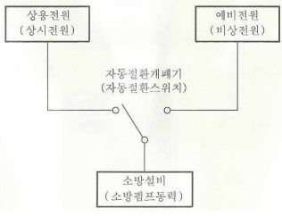
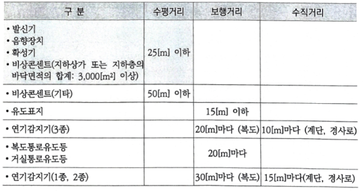

- ### 식별도 / 조도 / 휘도
  id:: 63f55f70-5d30-43d1-a483-3f5e9edcc3df
	- #### 식별도시험
		- 거실통로유도등,피난구유도등 (거피)
			- 상용전원 사용하는 경우 : 10~30$lx$ 조도 , 직선거리 30m 위치에서 식별 가능
			- 비상전원 사용하는 경우 :  0~ 1$lx$ 조도 , 직선거리 20m 위치에서 식별 가능
			- 출처:[@유도기형식승인 및 제품검사의 기술기준](((63d8784d-08b8-488c-b7e0-5ccd219331c4)))
			- 비교 :  연기감지기 복도,통로 설치시 1,2종(수평거리30m) / 3종 (수평거리20m)와 같다
		- 복도통로유도등
			- 상용전원 사용하는 경우 : 직선거리 ==20m== 위치에서 보통시력에 의하여 화살표 식별
			- 비상전원 사용하는 경우 : 직선거리 ==15m== 위치에서 보통시력에 의하여 화살표 식별
			- 비교 : 연기감지기 수직거리 15 m(3종에 있어서는 10 m)
			- ((63f9e73b-b206-42eb-b14b-d6787b3b0ce8))
		- 누전경보기 표시등
			- 주위의 밝기기 ==300lx== 이상인곳에서 측정하여 앞면으로부터 ==3m== 떨어진곳에서 식별 되어야 한다(누경=비콘)
			- 출처[@누전경보기의 형식승인](((63c397e8-5381-4331-a5cc-80a1f2e427fc)))
			- ((63f9a6c8-2041-4723-b74c-cef7c3948435))
		- 비상콘센트 표시등
			- 적색으로 표시되어야 하며 주위의 밝기가 300lx 이상인 장소에서 측정하여 앞면으로부터 3m 떨어진 곳에서 켜진등이 확실히 식별되어야 한다. (누경=비콘)
			- 출처[@비상콘센트의 성능인증](((63d879e3-d170-40c9-8184-21b2eb56f5f5)))
			- ((63fa212c-64d9-4a4b-9bd4-4a2089396f72))
		- 축광표지
			- 축광유도표지 20m 떨어진 위치에서 식별 가능
			- 축광위치표지 ==10m== 떨어진 위치에서 식별 가능
			- 축광유도표지 및 축광위치표지는 200 ㏓밝기의 광원으로 20분간 조사시킨 상태에서 시험
			- 출처[@축광표지의 성능인증](((63d8a11a-ff9c-46a8-a6de-e66be49f7c23)))
	- #### 조도시험
		- 비상조명등은 NFTC에 있다, 유도등은 형식승인 문서에 있다. 조도시험에서 설치높이기준이 있는데 이는 NFTC에 있는 설치기준과는 다른값이다. 그리고 측정위치, 수평조도/법선조도 등의 조건이 있다
		- 비상조명등 : ==1 lx==이상
		- 거실통로유도등,복도통로유도등 : 1 lx 이상
		- 계단통로유도등 :  바닥면으로부터 2.5m 위치에 유도등을 설치하고 그 유도동의 바로 밑으로부터 수평거리 10m 떨어진 위치에서 법선조도가 ==0.5==lx 이상이어야한다
		- 객석유도등 : ==0.2== lx 이상 (0.3m 떨어진위치에서 수평조도)
		- ((63f9ebc9-86e7-4374-b079-0ae5c68b654b))
		- ((63fa1e7c-6745-486b-9175-d9ab53027a9a))
		- ((63fae802-0a58-4586-8043-f85d9def03ef))
	- #### 휘도시험
		- 표지면 휘도는 주위 조도 0lx에서 60분간 발광 후  70mcd 이상
### 전원의 구분
	- 상용전원(주전원)
		- 축전지
		- 교류전압의 옥내간선
		- 전기저장장치
	- 비상전원 or 예비전원
		- 자가발전설비
			- 
		- 축전지 설비
		- 비상전원 수전설비
		- 전기저장장치
- ### 비상전원 적용(설비 별)
	- 스프링클러 , 비상콘센트 : 자축비전 모두 가능
	- 자탐,비방,비경,무통 : 축전지설비 , 전기저장장치 (==자비무축전==)
	- ==유도등 : 축전지설비==
	- 옥내소화전,제연설비,연결송수관설비 등.. : X비상전원수전설비 (==옥자축전==)
	- 축전지는 모두 가능
### 비상전원 설치기준(공통)
	- 점검 편리
	- 20분 이상 (기본이 20분이고,설비에 따라 다름)
	- 상용전원 정전시 자동으로 비상전원으로 전환
	- 실내에 설치시에는 비상조명등을 설치
	- 아무것도 둘 수 없다 (예외 : 열병합 발전설비에 필요한 것)
	- 비상전원의 설치장소는 다른 장소와 방화구획 할 것
- ### 비상전원 용량 (시간)
  id:: 63f55f70-b306-44bd-bb00-c0d1df378607
	- #### ==10분== 경보 , 60분 감시
		- (30층 이상은 30분 이상 경보)
		- 자동화재탐지설비
		- 자동화재속보설비
		- 비상경보설비
		- 비상방송설비
	- #### 20분
		- 유도등,비상조명등 (기본 20분)
		- 비상콘센트
		- 30~49층 : 40분 , 50층 이상 : 60분
	- #### ==30분==
		- ==증폭기==(무통)
	- #### ==60분==
		- 유도등,비상조명등 (기본 20분 , 아래 조건에서는 60분)
			- 지하층을 제외한 층수가 ==11층 이상==의 층
			- ==지하층 또는 무창층으로서 용도가 도매시장ㆍ소매시장==ㆍ여객자동차터미널ㆍ지하역사 또는 ==지하상가==
	- ((63fa2b8f-7402-4449-aac3-9fa2563d7251))
	- ((63fab24a-4ba9-4c2b-a1e0-8d3b94a55ed3))
- ### 시간 모음
	- 비상전원용량
	- 누전경보기 과누전시험 : 5분
		- 변류기는 1개의 전선을 변류기에 부착시킨 회로를 설치하고 출력단자에 부하저항을 접속한 상태로 당해 1개의 전선에 변류기의 정격전압의 20 %에 해당하는 수치의 전류를 5분간 흘리는 경우 그 구조 또는기능에 이상이 생기지 아니하여야 한다
	- 절연내력시험 : 1분 (모든 설비 공통)
- ### 소방시설 면제기준
	- 비상방송설비
		- 자동화재탐지설비
		- 비상경보설비
- ### 경종
	- #### 경종의 우수품질인증 기술기준
		- 중심으로부터 1m 떨어진 위치에서 ==90dB 이상==  (90dB는 속보기에서도 같다)
		- 최소청취거리에서 ==110dB== 를 초과하지 아니하여야 한다
		- 경종의 소비전류 : ==50mA 이하==
		- ((63f9aa16-f083-49fa-805e-35d9ff19f717))
	- #### 경종의 형식승인 및 제품검사의 기술기준??
		- 전원전압이 정격전압의 +/- ==20%== 범위에서 변동하는 경우 기능에 이상이 생기지 아니하여야한다
### 배선공사
	- X 애자공사 (노출공사라서 소방에서는 안된다)
### 저항
	- #### 전로저항
		- 자동화재탐지설비의 감지기회로의 전로저항은 50 Ω 이하가 되도록 해야 함
	- #### 종단저항
		- 시험목적 : 회로 도통시험
	- #### 무반사종단저항
		- 무선통신보조설비
	- #### 절연저항
	  id:: 63f2c05e-067f-4b11-8899-3a84c30b5080
		- #### 측정장비
			- 메거
		- #### 절연저항계의 전압에 따른 분류
			- DC 250V
				- ==0.1 MΩ 이상==
					- ==1경계구역의 절연저항==
					- 비상방송설비 150V 이하
				- 0.2 MΩ 이상
					- 비상방송설비 150V 초과
			- DC 500V
				- 5 MΩ이상 (==5유비조시누== : 조건에 관계없이 무조건 5MΩ)
				  id:: 63c4a074-dee4-4ebc-b736-0a77f093b464
					- 유도등
					- 시각경보장치
					- 비상조명등
					- 누전경보기
				- 5 MΩ이상 (경우에 따라 20MΩ이상)
					- 수신기
					  비상경보설비
					  가스누설경보기
						- ==20MΩ (선교외)==
							- 절연된 선로간
							- 교류입력측과 외함간
						- 5MΩ
							- 그외
							- 주의 : 절연된 충전부와 외함간
				- 20 MΩ 이상
					- ==비상콘센트==
					- 기기의 절연된 선로 간
					- 기기의 충전부와 비충전부 간
					- 기기의 교류입력측과 외함 간 (유도등,비상조명등 제외)
				- 1000 MΩ 이상
		- #### 측정방법
			- 전원부와 외함 사이에 ==정격전압 150V 기준 (1000V or 1000V ∓ 정격전압x2)==
			- 전압 조건이 조금씩 다르네 (따로 공부하지 않아도 될 것 같다)
				- 60V 초과 조건
					- 유도등,자속,비경 : 60V 초과 조건 있음
					- 비콘 : 60V 초과 조건 없음
				- 누전경보기 : 기준전압이 250V
			-
- ### 두께 기준
	- 누전경보기 외함
		- 일반적인 경우 : 1$mm$ 이상
		- 직접 벽면에 접하여 벽속에 매립되는 외함부분 : 1.6$mm$ 이상
	- 축전지 외함, 속보기 두께
		- 강판 : ==1.2==$mm$ 이상
		- 합성수지 : ==3== $mm$ 이상
	- 비상콘센트용 풀박스
		- ==1.6==$mm$ 이상의 철판을 사용할 것
	- 제1종 배전반 및 분전반
		- 외함두께 : 1.6$mm$ 이상
		- 전면판 및 문 두께 : 2.3$mm$ 이상
	- 큐비클
		- 외함은 ==2.3mm== 이상의 강판과 이와 동등 이상의 강도와 내화성능이 있는것
	- ((63f99792-22a1-42e1-9ff3-0c66adb15020))
	- ((63f9a66e-8470-4fc1-86df-b4515065e970))
	- ((63f9a6e9-37ba-4684-a275-4dd80d817f88))
	- ((63fa2dc1-39f0-4d79-a16e-151e38bc030d))
	- ((63fae84b-9a89-4292-8d0d-d44de75df8b8))
	- ((63fc2f2d-3190-4f8d-8da8-236444b6ebb3))
### 고정(지지)
	- 누설동축케이블
		- 금자 (금속제 또는 자기제)
		- ==4m== 이내 마다
		- ((63fae861-9b59-4df6-b697-74af94d449a7))
	- 공기관식
		- 스스(스테이플,스티커)
	- 정온식감지선형
		- 보고(보조선,고정금구)
### 비상조명등,유도등의 일반구조
	- 사용전압은 300V이하 (예외:충전부가 노출되지 아니한 경우)
	- 전선의 굵기 : 인출선 ==0.75==$mm^2$ 이상 , 인출선외 ==0.5==$mm^2$ 이상
	- 인출선의 길이는 150mm 이상
	- ==축전지에 배선 등을 직접 납땜하지 아니할 것==
### 비상경보설비/자탐 발신기 설치기준
	- 발신기의 위치표시등은 함의 ==상부==에 설치하되,
	- 그 불빛은 부착면으로부터 ==15도 이상==의 범위 안에서 부착지점으로부터 10m 이내에서 쉽게 식별할 수 있도록 적색등으로 할 것
### 비상콘센트/누전경보기 표시등의 구조 및 기능
	- 전구는 사용전압의 130%인 교류전압을 20시간 연속하여 가하는 경우 단선,현저한광속변화,흑화,전류의 저하 등이 발생하지 아니할 것
	- 주위의 밝기가 300lx 이상인 장소에서 측정하여 앞면으로부터 3m 떨어진 곳에서 켜진 등이 확실히 식별될 것
	- 전구는 2개 이상을 병렬로 접속하여야 한다(방전등 또는 발광다이오드 제외)
	- 전구에는 적당한 보호카바를 설치하여야한다 (발광다이오드 제외)
### 설치 높이
	- 시각경보장치
		- ==2~2.5m 이하==
		- 천장높이가 2m 이하는 천장에서 ==0.15m== 이내
	- 일반적인 (조작) : 0.8 ~ 1.5m
	- 종단저항 전용함 : 1.5m 이내
	- 복도통로유도등,계단통로유도등,통로유도표지 : 1m 이하
	- 거실통로유도등,피난구유도등(거피) : 1.5m 이하
	- 피난구유도표지 : 출입구 상단
	- 피난유도선
		- 축광방식 표시부 : 0.5m 이하 또는 바닥면
		- 광원점등방식 표시부 : 1m 이하 또는 바닥면
		- 광원점등방식 제어부 : 0.8~1.5m
- ### 거리 구분
	- 
	- 수평거리
		- 25m 이하
			- 음향장치
			- 비상콘센트(지하상가 또는 지하층 바닥면적 3000$m^2$ 이상)
			- 발신기 (다만, 복도 또는 별도로 구획된 실로서 보행거리 40m 이상이면 추가 설치)
		- 50m 이하
			- 비상콘센트(기타)
	- 보행거리
		- 유도표지 : 15m 이하
		- 복도,거실 통로유도등 : 20m 마다
	- 연기감지기 (1,2종은 친구)
		- 복도(보행거리) : 연기감지기 1,2종 : 30m  , 3종 : 20m
		- 계단(수직거리) : 연기감지기 1,2종 : 15m  , 3종 : 10m
	- 객석 : 4m
	- 무통 접속단자 : 보행거리 300m
- ### 소리 dB
	- 60dB (고장)
		- 고장
		- 단독경보형 감지기 건전지 성능저하 (음성안내)
		- 가스누설경보기 단독형 주전원의 건전지 성능 저하 시
	- 70dB (관계자)
		- 누전경보기
		- 가스누설경보기의 주음향장치 (단독형,영업용)
		- 단독경보형 감지기 건전지 성능저하
	- 85dB
		- 단독경보형 감지기
	- 90dB (다수인)
		- 자탐
		- 비방
		- 비경
		- 가스누설경보기의 주음향 장치 (공업용)
		- ((63f5b078-fa3b-4824-b175-deb200fe1f5b))
	- 110dB
		- 경종의 우수품질인증 조건
			- 최소청취거리에서 110dB 를 초과하지 아니하여야 한다
	- 단독경보형 감지기
		- 1m 떨어진 위치에서 85dB 이상으로 10분 이상 계속 경보
		- 건전지성능저하 : 70dB(음성 60dB)로 72시간 지속
- ### 음향장치 전압
	- 정격전압의 80% 전압에서 음향을 발할 것
		- 비상경보설비,비상방송설비,자동화재탐지설비,누전경보기 공통
### 퍼센트
	- 130% : 표시등 시험
		- 전구는 사용전압의 130%인 교류전압을 20시간 연속하여 가하는 경우 단선,현저한광속변화,흑화,전류의 저하 등이 발생하지 아니할 것(비콘,누경)
	- 110%
		- 사용전원전압의 ==110%== 범위 안에서는 지장이 없어야한다(비상조명등)
	- 80% : 기본
		- 음향장비는 80% 전압에서 음향을 발할 수 있어야 한다 (자탐,비경,누경)
		- 자탐 감지기의 선로저항음 50옴 이하이며,감지기 배선전압은 80% 이상일 것
	- 20%
		- 변류기의 정격전압의 ==20%==에 해당하는 수치의 전류를 ==5분==간 흘려 정상이어야(누전경보기 과누전시험)
		- 전원전압이 정격전압의 +/- ==20%== 범위에서 변동하는 경우 기능에 이상이 생기지 아니하여야한다 (경종의 기술기준)
	- 5% : 감광률 (암기:오감 ,감지기는 공칭감지농도 하한값이 감광률 5%/m 미만인 것으로 한다
	- 80% ~ 120% : 정상적인 기능 (속보기,수신기)
	- 90% ~ 110% : 비상경보설비 전원전압변동시험 (비상경보설비의 축전지의 성능인증)
### 3선식
	- 비상방송설비
		- 공통선 , 업무용 , 긴급용
	- 유도등
		- 공통선 , 상용선 , 충전선
- ### 예비전원
	- 비상조명등 , 가스누설경보기
		- 알칼리계 2차 축전지
		- 리튬계 2차 축전지
		- 무보수 밀폐형 연축전지
	- 유도등
		- ==알칼리계 2차 축전지==
		- ==리튬계 2차 축전지==
	- 속보기 예비전원 주위온도 충방전시험
		- 무보수 밀폐형 연축전지는 정격용량의 95%용량을 지속하는 시간이 ==30분== 이상
	- 안전장치시험
		- 예비전원은 1/5~1C 이하의 전류로 역충전하는 경우 ==5시간== 이내에 안전장치가 작동하여야 하며. 외관이 부풀어 오로거나 누액 등이 생기지 않을 것
		- ((63fc318c-5a9b-4790-9a62-71c60a8e2068))
	- 배선
		- 양극 : 적색
		- 음극 : 청색 또는 흑색
	- 속보기 예비전원시험
		- 충전시험
		- 방전시험 (완전방전시험 : 셀당 0.6V 이하가 되도록 방전)
		- 안전장치시험
### 증폭기
	- 소화활동시 안내방송에 사용하는 증폭기의 종류는? : 휴대형
	- ((63f9e8d2-fe38-44cc-a7fa-934cf2c6be66))
- ### 배선 기준
	- 비상방송설비/비상경보설비/자탐
	- 배선은 별도의 관... 등에 설치할 것 (예외:60V 미만의 약전류이고 전압이 같으면 제외)
	- 절연저항은 1경계구역마다 직류 250 V의 절연저항측정기를 사용하여 측정한 절연저항이 ==0.1 ㏁== 이상이 되도록 할 것
	- 케이블의 종류
		- 0.6/1kV EP 고무절연 클로로프렌시스케이블
		- 450/750V 저독성난연가교폴리올레핀절연전선
		- 내열성 에틸렌-비닐 아세테이트 고무절연케이블
		- 버스덕트
	- ((63f995d9-7a74-4785-ad71-643235820d2f))
### 반복시험 횟수
	- 1000회
	- 2000회
	- 2500회
	- 5000회
	- ==10000==회 : ==누전경보기==
### 전압
	- ==0.5V 이하   : 누전경보기의 전압강하==
	- 0.6V 이하   : 축전지의 완전방전
	- ==60V 초과   : 금속제외함의 접지단자 설치== (공통)
	- ==300V 이하 : 누전경보기에 사용하는 변압기의 정격 1차 전압== , 유도등및 비상조명등의 사용전압
	- ==600V 이하 : 누전경보기의 경계전로 전압 ==
### 기능시험
	- 공기관식감지기 : 화재작동시험
	- 수신기 : 화재작동표시시험
### 교차회로방식 배선
	- 수손피해
		- 준비작동식 SP
		- 일제살수식 SP
	- 사람이 사망
		- 이산화탄소 (질식)
	- 고가
		- 할론
		- 할로겐 화합물 및 불할성기체 소화약제
		- 분말소화기
### 이격거리 (1.5m)
	- 감지기와 공기유입구 이격거리
	- 누설동축케이블과 고압의 전로와 이격거리
	- 공기관과 벽과의 이격거리
- ### 각도
	- 5도 : 공기관식 차동식 분포형 감지기의 검출부 각도 (외경이 1.9m로 조금만 구부려져도 구멍이 막힌다, 손오공)
	- 15도 : 발신기의 표시등 (10m)
	- 45도 : 스포트형 감지기 (사스)
### 접점
	- 전자계전기 : G.S 합금
	- 감지기 : P.G.S 합금
- ### 경보 소요시간
	- 5초 이내
		- P형(R형) 수신기
		- ==중계기==
	- 10초 이하
		- ==비상방송설비== (처음엔 사이렌이 울리다가  10초 안에 음성이 나온다)
	- 60초 이내
		- P형(R형) 수신기 (축척형 )
		- ==가스누설경보기==
	- ((63fab343-ccd0-4307-8a84-a8389356ecfb))
### 도색
collapsed:: true
	- 소화설비의 동력제어반(MCC 패널 앞면에는 적색으로 도색)
- ### 우선경보방식
  collapsed:: true
	- 비상방송설비,자동화재탐지설비 기준 동일
	- |대상|층수가 11층(공동주택의 경우에는 16층)이상|
	  |2층이상| 발화층 + 직상 4개층|
	  |1층|발화층 + 직상 4개층 + 지하층|
	  |지하층|발화층 + 직상층 + 기타의 지하층|