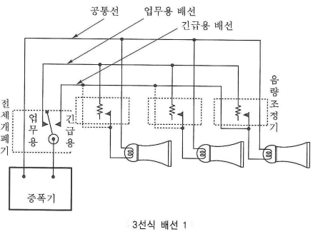

- ### 비상방송설비
	- 증폭기 : 전압전류의 진폭을 늘려 감도를 좋게하고 미약한 음성전류를 커다란 음성전류로 변화시켜 소리를 크게하는 장치
	- "음량조절기"란 가변저항을 이용하여 전류를 변화시켜 음량을 크게 하거나 작게 조절할 수 있는 장치를 말한다.
	- 계통도 : 감지기/기동장치 -> ==수신기== -> 증폭기 -> 조작장치 -> 스피커(확성기)
		- ((63f63b4d-d9b8-4930-b183-49eb489c5ca9))
		- 
		- ((63f9a7a5-a71c-43ed-bcd9-10a4984c3a2c))
- ### 비상방송설비 설치대상
	- ((63f4053c-6b1b-4d72-96d0-869fce5e5ac4))
- ### 비상방송설비 음향장치 설치기준
	- 자탐과 연동
	- 확성기는 각 층마다 설치하되, 각 부분으로부터의 수평거리는 ==25m== 이하
	- 음량조정기는 ==3선식== 배선일 것 (공통선,업무용배선,긴급용배선)
	- 비상방송 개시시간은 ==10초== 이하
	- 정격전압의 ==80%== 전압에서 음향을 발할 수 있어야한다
	- 다른 방송설비와 공유시에 화재시 비상경보 외의 방송을 차단하는 구조 (절체개폐기:업무용/긴급용)
	- ==확성기 3W 이상 (실내 1W)==
	- ((63fc25de-288e-41ec-9209-a0a41b42b71c))
- ### 비상방송설비 우선경보방식
	- [NFTC 202 일제경보](((63f4140e-43c4-417c-9123-7b50bdcdf098)))
	- 자탐과 동일하게 변경
- ### 배선
	- 전원회로의 배선은 내화배선, 그 밖의 배선은 내화배선 또는 내열배선
	- 화재로 인하여 하나의 층의 확성기 또는 배선이 단락 또는 단선되어도 다른 층의 화재 통보에 지장이 없도록 할 것
	- 비상방송설비의 배선은 다른 전선과 ==별도의 관ᆞ덕트==(절연효력이 있는 것으로 구획한 때에는 그 구획된부분은 별개의 덕트로 본다) 몰드 또는 풀박스 등에 설치할 것. 다만, 60 V 미만의 약전류회로에 사용하는 전선으로서 각각의 전압이 같을 때는 그렇지 않다
-