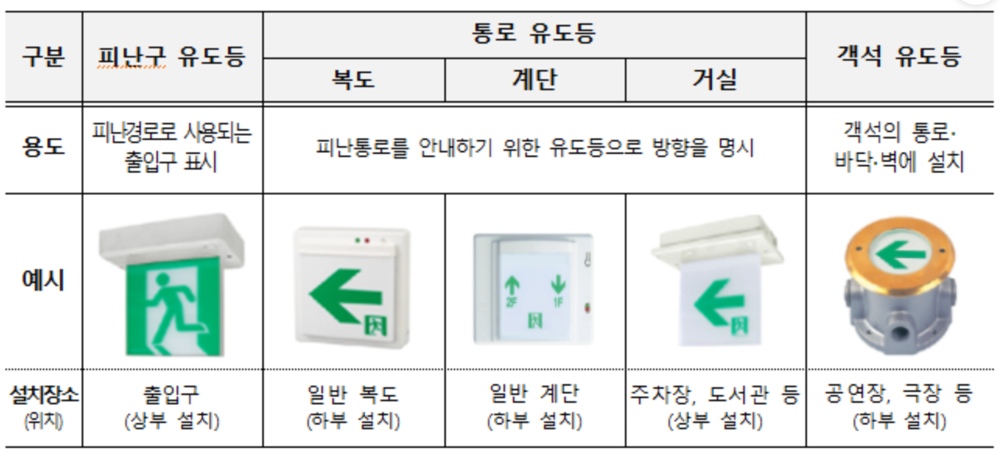
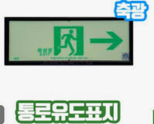
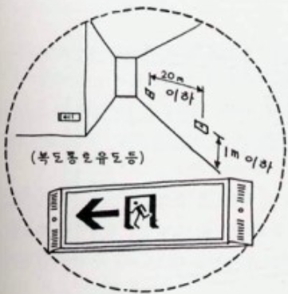

- ### 유도등 종류
  collapsed:: true
	- 유도등
		- 피난구유도등 : 피난구로 사용되는 출입구가 있음을 알린다. 사람모양. 대/중/소
		- 통로유도등 : 피난통로 안내
			- 계단통로유도등
			- 복도통로유도등
			- 거실통로유도등
		- 객석유도등
	- 유도표지
		- 피난구유도표지
		- 통로유도표지
	- 피난유도선
		- 축광방식
		- 광원점등방식
	- 사진
		- 
		- 
		- 
		- 
	-
- ### 통로유도등 설치기준 (높이,간격,색상)
  collapsed:: true
	- #### 높이
		- 거실통로유도등,피난구유도등 : ==거피 1.5m 이상== (높이와 식별도 거피는 친구)
		- 피난구유도표지 : 출입구 상단
		- 피난유도선
			- ==축광방식 피난유도선 : 50cm 이하 또는 바닥면==
			- ==광원점등방식 피난유도선 : 1m 이하 또는 바닥면==  (제어부 0.8~1.5)
	- #### 간격 (설치개수  = $\dfrac{길이}{N} -1$ )
		- ==객석유도등 : 4m==
		- ==유도표지 : 보행거리 15m== , 구부러진모퉁이
		- 복도통로유도등 : 구부러진 모퉁이 및 보행거리 ==20m==마다
		- 거실통로유도등 : 구부러진 모퉁이 및 보행거리 ==20m==마다
		- 계단통로유도등 : 각 층의 경사로참 또는 계단참마다
		- ==피난유도선 : 50cm 이내==의 간격 (광원점등방식의 경우 장애물이 있으면 ==1m== 이내)
	- #### 색상
		- 피난구유도등 : 녹색바탕 백색문자
		- 통로유도등 : 백색바탕 녹색문자 (==통백바==)
- ### 피난구유도등의 설치장소
  collapsed:: true
	- ((63b05c5a-61e9-44e3-8dd0-493f40778d10))
	- 암기 : 옥직출안
	- ==옥내로부터 직접 지상으로 통하는 출입구 및 그 부속실의 출입구==
	- 직통계단·직통계단의 계단실 및 그 부속실의 출입구
	- 출입구에 이르는 복도 또는 통로로 통하는 출입구
	- 안전구획된 거실로 통하는 출입구
	- X 옥외로부터 직접 지하로 통하는 출입구 (피난유도인데 지하로 안내하면 안됨)
	- ((63fae95b-9aab-490a-b20e-7de2d586bced))
- ### 유도등 설치 제외
	- [@NFTC유도등 제외기준](((63b06239-52ae-4467-91f9-e937dcaa8a8d)))
	- 통로유도등
		- 구부러지지 아니한 복도 또는 통로로서 길이가 30 m 미만인 복도 또는 통로
		- 보행거리가 20 m 미만이고 그 복도 또는 통로와 연결된 출입구 또는 그 부속실의 출입구에 피난구유도등이 설치된 복도 또는 통로
	- 객석유도등
		- 주간에만 사용하는 장소로서 채광이 충분한 객석
		- 거실 등의 각부분으로부터 하나의 거실 출입구에 이르는 보행거리가 ==20m 이하==인 객석의 통로로서 그 통로에 통로유도등이 설치된 객석
	- 피난구유도등
		- 바닥면적 1000 미만인 층으로 옥내로부터 직접 지상으로 통하는 출입구
		- 대각선의 길이가 15m 이내인 구획된 실의 출입구
		- 거실 각 부분으로 부터 하나의 출입구에 이르는 보행거리 20m 이하 (+비상조명등과,유도표지 설치)
		- 출입구 3이상 , 보행거리 30m 이하 , 주된 출입구 2개소 외의 출입구 (+유도표지 부착)
- ### 유도등 및 유도표지 설치장소
	- ((63b05bd3-53cc-458d-828d-f8e7c798960a))
	- 통로유도등 : 모두 설치
	- ==대형==피난구유도등(불특정 다수) , 통로유도등, 객석유도등 (==공집관운 대통객==)
		- 공연장,집회장,관람장,==운동시설==,유흥주점
	- 중형 피난구유도등,통로유도등
		- 숙박시설(관광숙박업 제외) , 오피스텔 , 11층 이상인 특정소방대상물
	- ((63f8caed-8f77-4a4f-9b1b-9a76c406250c))
	- ((63fc3003-a9c7-42ff-adf5-f610a69c9e6d))
### 유도등의 3선식 배선시 점등되는 경우
	- ((63b06200-b79d-4b32-b5b6-3a12f7a842db))
	- 자동소화설비 작동
	- 비상경보설비 발신기 작동
	- 자탐 감지기 작동
	- X : 제연설비 작동
	- ((63fc26be-85ea-4712-b9ab-bb2a55259dba))
- ### 유도등의 일반구조 (형식승인)
	- 축전지에 배선 등을 직접 납땜하지 아니할 것
	- 사용전압은 300V 이하  (충전부가 노출되지 아니한 것은 초과 가능)
	- 예비전원을 ==병렬== 접속하는 경우는 역충전방지 등의 조치를 강구하여야한다
	- ((63faee82-e554-439c-b33c-71fe6e287228))
- ### 유도표지 설치기준
	- 각 층 복도의 각 부분에서 유도표지까지의 보행거리 ==15m== 이하 (계단에 설치하는 것 제외)
	- 구부러진 모퉁이의 벽에 설치
	- 통로유도표지는 높이 1m 이하에 설치
	- 주위에 광고물,게시물 등을 설치하지 아니할 것
	- ((63fa2e51-3af1-4596-b8cc-8f44788dba3a))
### 객석유도등의 설치위치
	- 객석의 통로,바닥,벽 (==통닥벽==)
### 피난유도선 설치기준
	- 구획된 각 실로부터 주출입구 또는 비상구까지 설치
	- 50cm 이내의 간격 (광원점등방식의 경우 장애물이 있으면 ==1m== 이내)
### 복도통로유도등 설치기준
	- ((63b05e86-89de-4152-94e6-0c585dcd63e1))
	- 구부러진 모퉁이 및 보행거리 20m 마다 설치할 것
	- 바닥으로부터 높이 1m 이하에 설치할 것.
	- 다만, 지하층 또는 무창층의 용도가 도매시장·소매시장·여객자동차터미널·지하역사 또는 지하상가인 경우에는 복도·통로 중앙부분의 바닥에 설치해야 한다.
### 거실통로유도등의 설치기준
	- ((63b05ec7-3375-4be1-905b-d6dade69da4a))
	- 거실의 통로에 설치할 것. 다만, 거실의 통로가 벽체 등으로 구획된 경우에는 복도통로유도등을 설치할것
	- 구부러진 모퉁이 및 보행거리 20 m마다 설치할 것
	- 바닥으로부터 높이 1.5 m 이상의 위치에 설치할 것
	- 다만, 거실통로에 기둥이 설치된 경우에는 기둥 부분의 바닥으로부터 높이 1.5 m 이하의 위치에 설치할 수 있다.
### 계단통로유도등의 설치기준
	- ((63b05f0b-aa43-4a98-941a-c936363d4efc))
	- 각층의 경사로 참 또는 계단참마다(1개 층에 경사로 참 또는 계단참이 2 이상 있는 경우에는 2개의 계단 참마다)설치할 것
	- 바닥으로부터 높이 1 m 이하의 위치에 설치할 것
### 축광표지
	- 축광보조표지의 설치위치
		- ==계단,바닥,벽==
- ### 피난유도선 설치기준
	- ((63b45ac8-9f62-48f0-8034-e4f960ac1aaf))
	- 구획된 각 실로부터 주출입구 또는 비상구까지 설치할 것
	- ((63fc311d-8468-4410-bac8-1441a8a22f2a))
### 유도등 배선의 기준
	- ((63b06123-892d-4d9d-b328-233c5cd5b89f))
	- 유도등의 인입선과 옥내배선은 직접 연결할 것
	- 유도등은 전기회로에 점멸기를 설치하지 않고 ==항상 점등 상태==를 유지할 것.
	- 다만, 특정소방대상물 또는 그부분에 사람이 없거나 다음의 어느 하나에 해당하는 장소로서 3선식 배선에 따라 상시 충전되는 구조인 경우에는 그렇지 않다.
		- 2.7.3.2.1 외부의 빛에 의해 피난구 또는 피난방향을 쉽게 식별할 수 있는 장소
		- 2.7.3.2.2 공연장, 암실(暗室) 등으로서 어두워야 할 필요가 있는 장소
		- 2.7.3.2.3 특정소방대상물의 관계인 또는 종사원이 주로 사용하는 장소
### 용어
	- 유도등에 있어서 표시면 외 조명에 사용되는 면 : 조사면
	- 패널식 : 영상표시소자를 이용하여 피난유도표지 형상을 영상으올 구현하는 방식