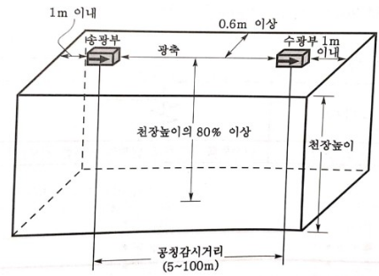
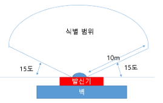
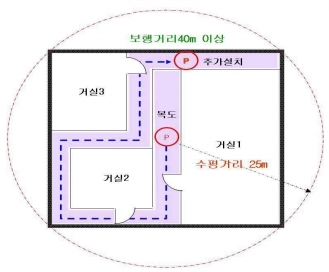

- ## 감지기
  collapsed:: true
	- ### 감지기 종류
	  collapsed:: true
		- 열감지기
			- 차동식 : 온도변화가 심하지 않는 장소
				- 스포트형
				- 분포형
					- 공기관식
					- 열전대식
					- 열반도체식
			- 보상식 : 차동식/정온식의 OR조건
				- 스포트형
				- 분포형
			- 정온식 : 차동식보다 온도가 높은 장소(주방)
				- 스포트형
				- 감지선형 : ==일국소==의 주위온도가 일정한 온도 이상이 되있을 때 작동하는 것으로서 ==외관이 전선==으로 되어 있는 것을 말한다.
		- 연기감지기
			- 이온화식 스포트형
			- 광전식
				- 분리형
				- 스포트형
				- ==공기흡입형==
		- 불꽃감지기
		- 복합형감지기 (AND조건)
	- ### 감지기 적응성
	  collapsed:: true
		- 암기 : 고온은 정열이다
		- 주방,기타 평상시에 연기 체류 : 정온식특종,정온식1종,열아날로그식,불꽃
		- 현저하게 고온으로 되는 장소 (연기감지기 설치 불가 장소) :  ==정온식==(특종,1종),==열아날로그식==
		- 전화실,통신기기실 적응성 감지기(훈소화재)  : ==광전식== 이름이 들어가는 감지기
		  id:: 63b570bd-640e-4e5b-9af4-eab4bb48379a
	- ### 감지기 설치기준
	  collapsed:: true
		- ((63b00bee-0890-4e77-986c-512a841d04f2))
		- 실내로의 공기유입구로부터 1.5m 이상 떨어진 위치에 설치(차동식분포형 제외)
		- 감지기는 천장 또는 반자의 옥내에 면하는 부분에 설치할 것
		- 온도 기준
			- 보상식스포트형감지기는 정온점이 감지기 주위의 평상시 최고온도보다 20 °C 이상 높은 것으로 설치할 것
			- 정온식감지기는 주방ᆞ보일러실 등으로서 다량의 화기를 취급하는 장소에 설치하되, 공칭작동온도가 최고주위온도보다 ==20 °C 이상== 높은 것으로 설치할 것
		- 각도 기준
			- 스포트형감지기 : ==45==° 이상 경사되지 않도록 부착할 것
			- 공기관식 차동식 분포형 감지기의 검출부 : ==5==° 이상 경사되지 않도록 부착할 것 (손오공)
			- 불꽃감지기 중 도로형의 최대시야각 : ==180==$\degree$
	- ### 광아다축불분정복
	  collapsed:: true
		- ((63b02d07-7893-4de9-820c-dc8638f5a1b5))
		- 광 : 광전식 중 분리형 감지기
		- 문제1) 아래 지문의 협소한장소
		- 문제2) 비화재보의 우려가 있는 곳에 설치가 가능한 감지기
		- 문제3) 교차회로방식 배선의 감지기에 사용되지 않는 감지기
		- 문제4) 지하공동구에 설치가 가능한 감지기
		- 자동화재탐지설비의 수신기는 특정소방대상물 또는 그 부분이 지하층ㆍ무창층 등으로서 환기가 잘되지 아 니하거나 실내면적이 40 ㎡ 미만인 장소, 감지기의 부착면과 실내 바닥과의 거리가 2.3 m 이하인 장소로서 일 시적으로 발생한 ㆍ연기 또는 먼지 등으로 인하여 감지기가 화재신호를 발신할 우려가 있는 때에는 축적기능 등이 있는 것으로 설치해야 한다 =>광아다축불분정복 감지기는 축적기능이 없어도 설치할 수 있다
			- ==광전식분리형감지기==
			- 아날로그방식의 감지기
			- 다신호방식의 감지기
			- 축적방식의 감지기
			- 불꽃감지기
			- 분포형감지기
			- ==정온식감지선형감지기==
			- 복합형감지기
	- ### 정온식 감지선형 감지기
	  collapsed:: true
		- ((63b00843-d819-4d4e-b386-8ea50b935a54))
		- ==일국소==의 주위온도가 일정한 온도 이상이 되있을 때 작동하는 것으로서 ==외관이 전선==으로 되어 있는 것을 말한다.
		- ==보조선이나 고정금구==를 사용하여 감지선이 늘어지지 않도록 설치할 것
		- 단자부와 마감고정금구와의 설치간격은 10cm 이내로 할 것
		- 감지선형 감지기의 굴곡반경은 ==5cm 이상==으로 할 것 (X 5mm)
		- 감지기와 감지구역의 각부분과 수평거리
			- ||1종|2종|
			  |내화|4.5m이하|3m 이하|
			  |기타|3m 이하|1m 이하|
	- ### 이온화식 연기감지기
	  collapsed:: true
		- 방사선 동위원소 : 아메리슘241($Am^{241}$),아메리슘95($Am^{95}$), 라듐(Ra)
		- 방사선 : 알파선
	- ### 공기관식 감지기 설치기준
	  collapsed:: true
		- ((63b0093a-4b18-4689-a8bb-cf46bd9874d5))
		- 공기관의 ==노출 부분은 감지구역마다 20 m 이상==이 되도록 할 것
		- 하나의 검출 부분에 접속하는 ==공기관의 길이는 100 m 이하==로 할 것
		- ==각 변과의 수평거리는 1.5 m 이하==
		- ==공기관 상호 간의 거리는 6m==(내화구조로 된 특정소방대상물 또는 그 부분에 있어서는 9 m) 이하가 되도록 할 것
		- 공기관은 ==도중에서 분기하지 않도록== 할 것
		- ==검출부는 5° 이상 경사되지 않도록== 부착할 것
		- 검출부는 바닥으로부터 0.8 m 이상 1.5 m 이하의 위치에 설치할 것
		- ==두께  0.3mm 이상==
		- ==외경 1.9mm 이상==
		- 공기관식 차동식 분포형 감지기의 기능시험을 하였더니 검출기의 접점수고치가 규정 이상으로 되어있었다. 이때 발생되는 장애로 볼 수 있는 것은? -> 작동이 늦어진다
	- ### 광전식 아날로그방식 감지기
	  collapsed:: true
		- 공칭감지농도 하한값이 ==감광률 5%==/m 미만인 것으로 한다. (오감)
	- ### 광전식 분리형 감지기 설치기준
	  collapsed:: true
		- ((63b0090b-2bbd-4e0f-b069-ec3c80e3cdb6))
		- 감지기의 수광면은 햇빛을 직접 받지 않도록 설치할 것
		- ==광축은 벽으로부터 0.6m 이상 이격==
		- 뒷벽으로부터 1m 이내
		- ==광축의 높이는 천장 높이의 80% 이상==
		- 감지기의 광축의 길이는 공칭감시거리 범위 이내일 것
		- 
	- ### 쉴드선을 사용해야 하는 감지기
	  collapsed:: true
		- 아날로그식 감지기
		- 다신호식 감지기
		- R형 수신기형으로 사용되는 감지기
	- ### 불꽃감지기 설치기준
	  collapsed:: true
		- ((63b008fb-6b0e-4e37-9149-73c1f9039afb))
		- 공칭감시거리 및 공칭시야각은 형식승인 내용을 따를것
		- 감지기를 천장에 설치하는 경우에는 감지기는 ==바닥을 향하여== 설치할 것
		- 감지기는 화재감지를 유효하게 감지할 수 있는 모서리 또는 벽등에 설치할 것
			- 미기출
				- 20m 미만의 장소 : 1m 간격 , 5도(공칭시야각)
				- 20m 이상의 장소 : 5m 간격 , 5도(공칭시야각)
	- ### 연기감지기 설치장소
	  collapsed:: true
		- 설치장소
			- ((63b00b6f-c54e-4f7c-80b7-b54464515a1f))
			- 계단ㆍ경사로 및 에스컬레이터 경사로
			- 복도(==30 m 미만의 것을 제외==한다 ) <-- 연기감지기를 설치하지 않아도 되는 장소로, 이것만 기출
			- 엘리베이터 승강로(권상기실이 있는 경우에는 권상기실)ㆍ린넨슈트ㆍ파이프 피트 및 덕트 기타 이와 유 사한 장소
			- 천장 또는 반자의 높이가 15 m 이상 20 m 미만의 장소
			- 다음의 어느 하나에 해당하는 특정소방대상물의 취침ㆍ숙박ㆍ입원 등 이와 유사한 용도로 사용되는 거실 (세월호 사건이후에 추가된 조건, 공통적으로 잠을 잘 수 있는 공간이다)
				- (1) 공동주택ㆍ오피스텔ㆍ숙박시설ㆍ노유자시설ㆍ수련시설
				- (2) 교육연구시설 중 합숙소
				- (3) 의료시설, 근린생활시설 중 입원실이 있는 의원ㆍ조산원
				- (4) 교정 및 군사시설
				- (5) 근린생활시설 중 고시원
		- 예외 (설치하지 않아도 되는 경우)
			- 다만, 교차회로방식에 따른 감지기가 설치된 장소 또는 2.4.1 단서에 따른 감지기가 설치된 장소에는 그렇지 않다. (2.4.1 : 광아다축불분정복)
			- 복도가 30m 미만인 경우
	- ### 연기감지기 설치기준
	  collapsed:: true
		- ((63b00923-e3ed-4365-830d-def32c1a71e0))
		- 연감지기의 부착 높이에 따라 다음 표 2.4.3.10.1에 따른 바닥면적마다 1개 이상으로 할 것
		- 감지기는 복도 및 통로에 있어서는 ==보행거리 30 m(3종에 있어서는 20 m)==마다, 계단 및 경사로에 있어 서는 ==수직거리 15 m(3종에 있어서는 10 m)==마다 1개 이상으로 할 것
		- 천장 또는 반자가 낮은 실내 또는 좁은 실내에 있어서는 출입구의 가까운 부분에 설치할 것
		- 천장 또는 반자 부근에 배기구가 있는 경우에는 그 부근에 설치할 것
		- 감지기는 ==벽 또는 보로부터 0.6 m 이상== 떨어진 곳에 설치할 것 (이유는 사각지대,광전식분리형 감지기 기준과 같다)
	- ### 감지기 설치높이
	  collapsed:: true
		- 레벨에 따른 감지기 설치 높이 분류
			- L1(20m 이상) : 불꽃감지기, 광전식(분리형,공기흡입형) 중 아날로그방식 감지기
			- L2(20m 미만) : 연기감지기 (이온화식,광전식 감지기)
			- L3(15m 미만) : ==차동식 분포형== 감지기
			- L4 : 열 스포트형 감지기 (차,정,보)
	- ### 바닥면적에 따른 감지기 설치기준
	  collapsed:: true
		- 설치개수 = 바닥면적 / 기준면적
		- #### 열감지기 바닥면적
			- ((63b02dfb-c02b-4b90-9eb7-8049b325514a))
		- #### 연기감지기의 바닥면적
			- | 높이   | 1종,2종 | 3종    |
			   | ------ | ------- | ------ |
			   | 4m미만     | ==150== | ==50== |
			   | 4m미만 | 75      |    X    |
		- 열반도체식 감지기의 바닥면적 (기출빈도 낮으니 65만 외우자)
			- 설치개수 : 2 ~ 15개  (부착높이가 8m 미만이고 바닥이 기준면적이하인 경우 1개 가능)
			- | 높이      | 1종    | 2종 |
			   | --------- | ------ | --- |
			   | 8m미만(내)    | ==65== | 36  |
			   | 8m미만(기)    | 40     | 23  |
			   | 15m미만(내) | 50     | 36  |
			   | 15m미만(기) | 30     | 23  |
		- 열전대식 (기출X)
			- 기타구조 : 18제곱미터
			- 내화구조 : 22제곱미터
			- 설치개수 : 4~20개 이하
	- ### 감지기 형식 구조
	  collapsed:: true
		- 연기감지기의 감시챔버는 : ==1.3 +/- 0.05mm== 의 물체가 침입할 수 없는 구조
	- ### 감지기 설치 제외 장소
	  collapsed:: true
		- 실기 5가지 암기 , 필기 괄호 넣기
		- 천장 또는 반자의 높이가 ==20m== 이상인 장소 (부착높이에 따라 적응성이 있는 장소는 제외 : 불꽃감지기,광전식(분리형,공기흡입형) 중 아날로그방식)
		- 부식성 가스가 체류하고 있는 장소
		- 목욕실,욕조나 샤워시설이 있는 화장실
		- 고온도 및 저온도로서 감지기의 기능이 정지되기 쉽거나 감지기의 유지관리가 어려운 장소
		- 파이프덕트 등 그 밖의 이와 비슷한 것으로서 2개 층마다 방화구획된 것이나 수평단면적이 5 ㎡ 이하인 것
		- 먼지ㆍ가루 또는 수증기가 다량으로 체류하는 장소 또는 주방 등 평상시 연기가 발생하는 장소(연기감지기에 한한다)
		- 프레스공장ㆍ주조공장 등 화재 발생의 위험이 적은 장소로서 감지기의 유지관리가 어려운 장소
	- ### 감지기회로의 도통시험을 위한 종단저항 설치기준
	  collapsed:: true
		- 전용함을 설치하는 경우 설치높이는 ==1.5m 이하==
		- 감지기회로의 끝부분
		- 점검 및 관리가 쉬운 장소에 설치할 것
- ## 수신기
  collapsed:: true
	- ### 수신기 종류
		- P형
			- 공통신호
			- 외부배선의 도통시험 여부를 시험할 수 있는 장치가 있어야한다
		- R형
			- 고유신호
			- 자동으로 단선(고장) 여부가 확인된다
		- GP형
		- GR형
		- 복합형
	- ### P형 수신기 표시등
		- 화재표시등
		- 지구표시등
		- 응답램프등 (발신기등)
			- 자동(감지기) : 화재표시등 + 지구표시등
			- 수동(발신기) : 화재표시등 + 지구표시등 + 응답램프
		- 벨(경종)
			- 화재시  주벨(주경종), 지구벨(지구경종)이 모두 울린다
	- ### 수신기의 정의
		- 발신기에서 발하는 화재신호를 ==직접 수신==하여 화재의 발생을 표시 및 경보하여 주는 장치
	- ### 수신기의 구조 및 일반기능
		- 수신완료 소요시간 5초이내 (축척형 60초)
		- ==공통신호용단자는 7개회로마다 1개씩 설치== (=하나의 공통선에 접속할 수 있는 경계구역 수)
		- ==주음향장치는 수신기의 내부 또는 그 직근에 설치==
	- ### 수신기 적합기준
	  ((63b02f21-0276-402d-8846-c9ece87059e0))
		- 경계구역을 각각 표시할 수 있는 회선수 이상의 수신기를 설치할 것
		- 가스누설탐지설비가 설치된 경우에는 가스누설탐지설비로부터 가스누설신호를 수신하여 가스누설경보를 할 수 있는 수신기를 설치할 것
		- 지하,무창층 40 ㎡ 미만 2.3m 이하는 축척기능이 있는 것으로 설치 (광아다축불분정복 감지기가 있으면 예외이다)
	- ### 수신기 설치기준
		- ((63b02f0d-d301-4245-8399-b2d787e617e6))
		- 경비실 등 상시 사람이 근무하는 장소에 설치할 것 (==쉽게 접근 가능==)
		- 하나의 경계구역은 하나의 표시등 또는 하나의 문자로 표시
		- 2 이상의 수신기를 설치하는 경우에는 상호간 연동
- ## 발신기
  collapsed:: true
	- ### 발신기의 내부단자
		- 공통
		- 회로(지구)
		- 응답(발신기)
		- X 경종
	- ### 발신기 설치기준
		- 조작이 쉬운 장소에 설치하고, ==스위치는 바닥으로부터 0.8 m 이상 1.5 m 이하의 높이==에 설치할 것
		- ==수평거리 25m (보행거리가 40m 이상이면 추가 설치)==
		- ==발신기의 위치를 표시하는 표시등은 함의 상부==에 설치
		- 그 불빛은 부착면으로부터  ==15도== 이상의 범위안에서 부착지점으로부터 ==10m== 이내의 어느곳에서도 쉽게 식별할 수 있는 ==적색등==으로 할 것
		- 지하구의 경우에는 발신기를 설치하지 아니할 수 있다
		- 
		- {:height 259, :width 294}
	- ### 발신기의 형식승인 및 제품검사 기술기준
		- 작동스위치의 동작방향으로 가하는 힘이 2kg을 초과하고 8kg 이하인 범위에서 확실하게 동작 (단, 2kg 의 힘을 가하는 경우 동작하지 않는다)
- ## 중계기
  collapsed:: true
	- ### 중계기의 구조 및 기능
		- 수신개시로부터 발신개시까지의 시간은 5초 이내일 것
		- 예비전원회로에는 단락사고 등으로부터 보호하기 위한 퓨즈를 설치할 것 (X 개폐기)
	- ### 중계기 설치기준
		- 수신기에서 직접감지기회로의 도통시험을 행하지 않는 경우에는 ==수신기와 감지기 사이==에 설치할 것 (R형)
		- ==수신기==에 따라 감시되지 아니하는 배선을 통하여 전력을 공급받는 것에 있어서는 전원입력측에 배선에 ==과전류차단기==를 설치하고 전원의 정전이 수신기에 표시되는 것으로 하며, ==상용전원 및 예비전원의 시험==을 할 수 있도록 할 것 (X누전차단기 )
- ## 음향장치 , 시각경보장치
  collapsed:: true
	- ### 자탐 음향장치
		- ((63b019a6-6011-494c-aa54-1acc59d2e4cd))
		- #### 자탐 우선경보
			- 우선경보 조건 : 층수가 11층(공동주택의 경우에는 16층) 이상의 특정소방대상물
			- 2층 이상의 층에서 발화한 때에는 발화층 및 그 직상 4개 층에 경보를 발할 것
			- 1층에서 발화한 때에는 발화층ᆞ그 직상 4개 층 및 지하층에 경보를 발할 것
			- 지하층에서 발화한 때에는 발화층ᆞ그 직상층 및 기타의 지하층에 경보를 발할 것
		- 지구음향장치는 특정소방대상물의 층마다 설치하되, 해당 층의 각 부분으로부터 하나의 음향장치까지의 ==수평거리가 25 m 이하==가 되도록 하고, 해당 층의 각 부분에 유효하게 경보를 발할 수 있도록 설치할 것
		- ==정격전압의 80 % 전압==에서 음향을 발할 수 있는 것으로 할 것
		- 음향의 크기는 부착된 음향장치의 중심으로부터 ==1 m 떨어진 위치에서 90 dB 이상==이 되는 것으로 할 것
		- 감지기 및 발신기의 작동과 연동하여 작동할 수 있는 것으로 할 것
	- ### 시각 경보장치 
	  ((63b01e29-2967-40ef-81cb-c35765c53c1d))
		- 실과 복도에는 모두
		- 각 부분으로부터 유효하게 경보를 발할 수 있는 위치에 설치할 것 (25m 기준이 없다)
		- 공연장ᆞ집회장ᆞ관람장 또는 이와 유사한 장소에 설치하는 경우에는 ==시선이 집중되는 무대부 부분== 등에
		  설치할 것
		- 설치 높이는 바닥으로부터 ==2 m 이상 2.5 m 이하==의 장소에 설치할 것. 다만, 천장의 높이가 2 m 이하인 경우에는 ==천장으로부터 0.15 m 이내==의 장소에 설치해야 한다.
- ## 경계구역
  collapsed:: true
	- ((63b02155-1eac-4fb7-9215-9b546cdefdf0))
	- ### 경계구역 정의
		- 특정소방대상물 중 화재신호를 발신하고 그 신호를 수신 및 유효하게 제어할 수 있는 구역
	- ### 경계구역 설정기준
		- 수평적 경계구역
			- 1경계구역이 2개 이상의 건축물에 미치지 않을 것
			- 1경계구역이 2개 이상의 층에 영향을 미치지 않을 것 (단, 500$m^2$ 이하는 ==2개층==을 1경계구역으로 하는 것이 가능)
			- 하나의 경계구역의 면적은 ==600== ㎡ 이하로 하고 한 변의 길이는 ==50 m 이하==로 할 것. 다만, 해당 특정소방대상물의 주된 출입구에서 그 내부 전체가 보이는 것에 있어서는 한 변의 길이가 50 m의 범위 내에서 1,000 ㎡이하로 할 수 있다.
			- 외기에 면하여 상시 개방된 부분이 있는 차고ㆍ주차장ㆍ창고 등에 있어서는 외기에 면하는 각 부분으로부 터 ==5m== 미만의 범위 안에 있는 부분은 경계구역의 면적에 산입하지 않는다.
		- 수직적 경계구역
			- 45 m 이하
			- 엘리베이터 개수 당 1개
			- 지하층의 계단 및 경사로(지하층의 층수가 한 개 층일 경우는 제외한다)는 별도로 하나의 경계구역으로 해야 한다
	- 계산 예제
		- 지하 3층, 지상 20층 , 면적 : 1000 , 50m 범위 안 , 계단 2개소, E/V 2개소
		- 수평 :  23층 x 1000/600 = 23 x 2 = 46
		- 수직 : 4 + 2+2
			- 지상계단 :  2개소 x (20층 x 3m / 45) = 4
			- 지하계단 :  2개소 x (3층 x 3m / 45) = 2
			- E/V : 2
		- 결과 = 수평 + 수직 = 46 + 4 + 2 + 2 = 54
- ## 자동화재탐지기 전원
  collapsed:: true
	- ((63b02a8a-9507-4dad-b3ac-802c07678818))
	- 감시상태를 60분간 지속한 후 유효하게 10분(감시상태 유지를 포함한다) 이상 경보할 수 있는 비상전원으로서 축전지설비(수신기에 내장하는 경우를 포함한다) 또는 전기저장장치(외부 전기에너지를 저장해 두었다가 필요한 때 전기를 공급하는 장치)를 설치해야 한다
	- ### 자탐 배선
		- ((63b02b59-f688-4a45-a41e-a6f350e1eacf))
		- 전원회로 : 내화배선 ,그 밖의 회로 : 내화 또는 내열배선
		- 쉴드선 : 아,다,R
		- 지기 사이의 회로의 배선은==송배선식==으로 할 것
		- P형 수신기 및 G.P형 수신기의 감지기 회로의 배선에 있어서 하나의 공통선에 접속할 수 있는 경계구역은==7개 이하==로 할 것
		- 자동화재탐지설비의 감지기회로의 전로저항은 50 Ω 이하가 되도록 해야 하며, 수신기의 각 회로별 종단에 설치되는 감지기에 접속되는 배선의 전압은 감지기 정격전압의 80 % 이상이어야 할 것
	- ### 자탐 배선의 설치기준
		- 자동화재탐지설비의 배선은 ==다른 전선과 별도의 관ㆍ덕트==(절연효력이 있는 것으로 구획한 때에는 그 구획된 부분은 별개의 덕트로 본다)ㆍ몰드 또는 풀박스 등에 설치할 것. ==다만, 60 V 미만의 약 전류회로에 사용하는 전선으로서 각각의 전압이 같을 때에는 그렇지 않다==. (비상방송설비 동일)
		- 감지기 사이의 회로의 배선은 ==송배선식==으로 할 것
		- 감지기 회로의 전로저항은 50$\Omega$ 이하로 할 것
	- ### 송배선식 또는 교차회로 배선
	  collapsed:: true
		- 송배선식배선 : 1회선
			- 자탐
			- 제연
		- 교차회로방식배선 : 2회선  (회로의 오작동방지)
			- 수손피해
				- 준비작동식 SP
				- 일제살수식 SP
			- 사망
				- CO2
			- 고가
				- 할론
				- 할로겐화합물 및 불활성
				- 분말